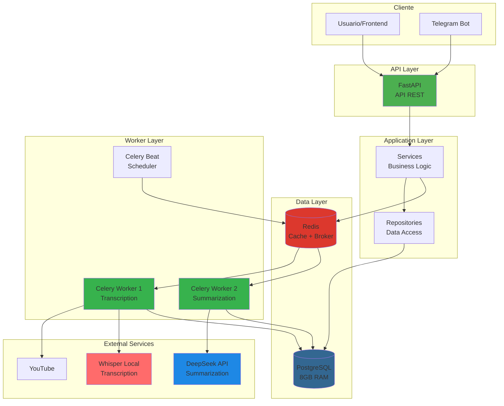
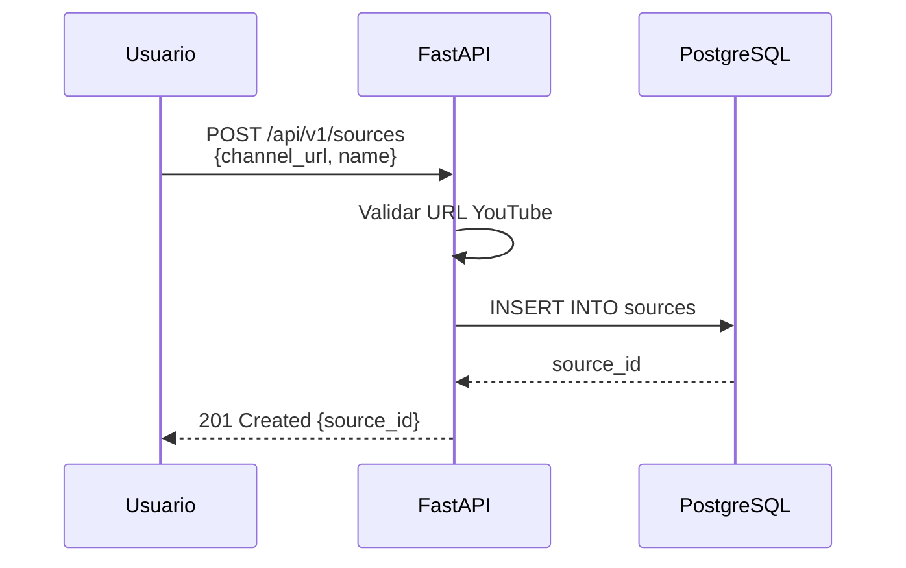
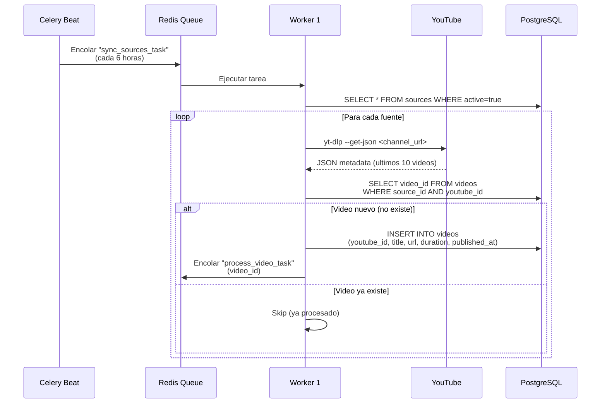
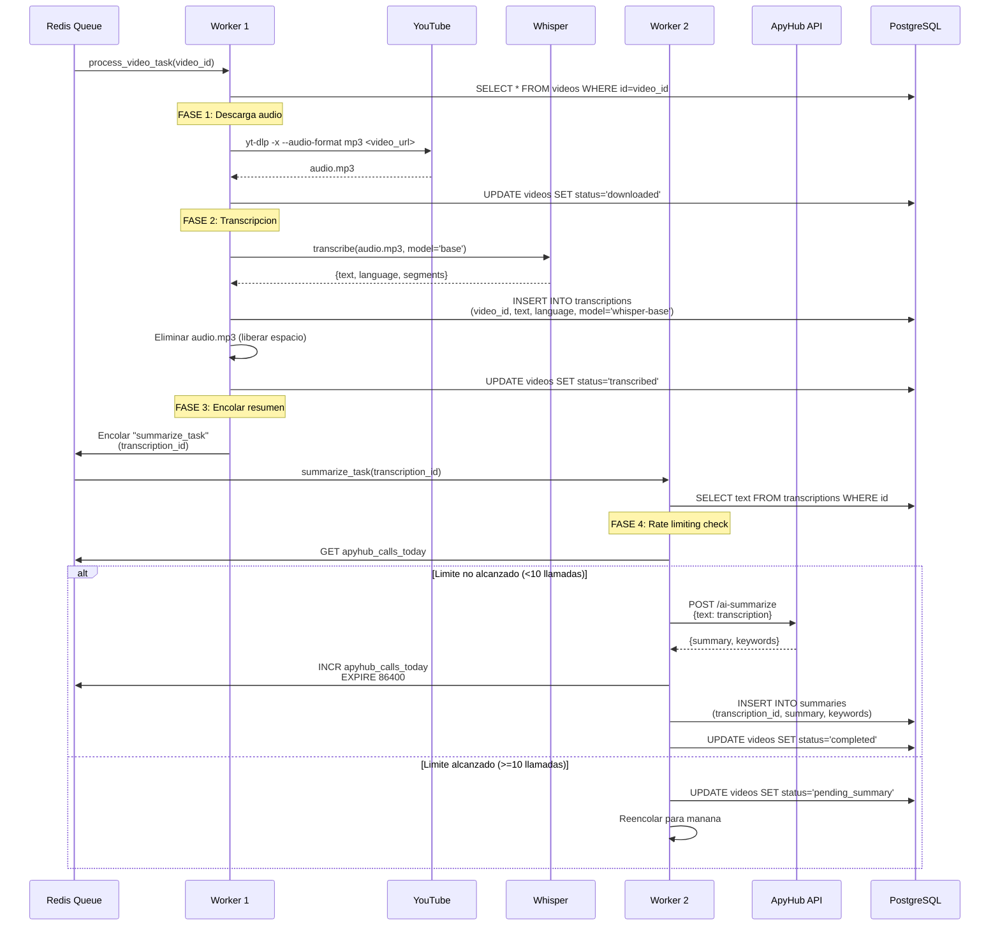
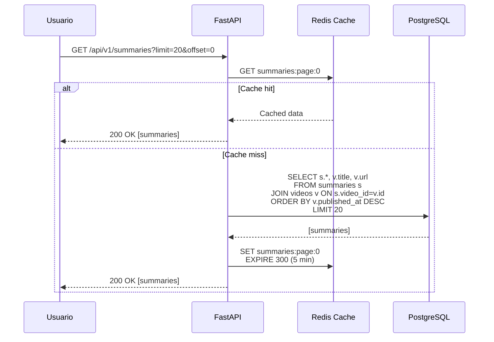
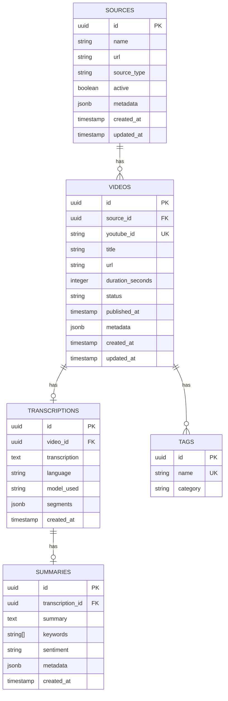
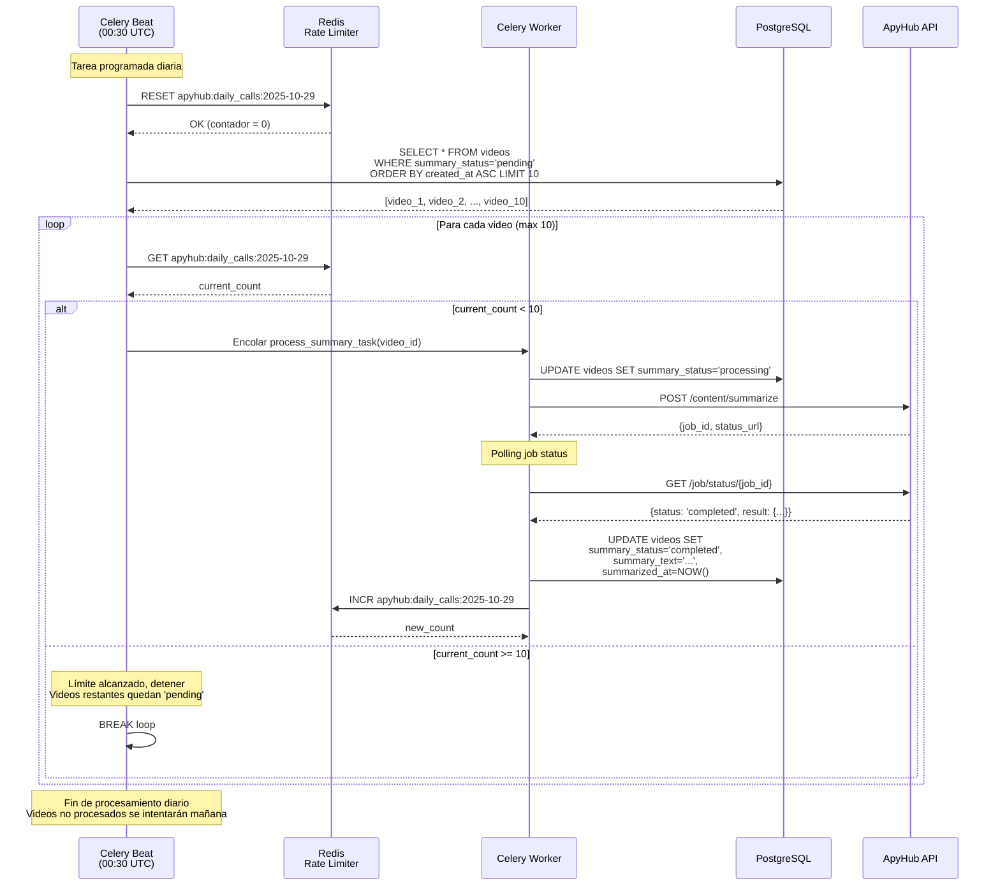

# ARQUITECTURA - IA MONITOR

**Version:** 1.0
**Fecha:** Octubre 2025
**Autor:** Prodelaya

---

## RESUMEN EJECUTIVO

**Proyecto:** Agregador inteligente de contenido sobre IA en desarrollo software
**Objetivo dual:**
- **Portfolio profesional:** Demostrar backend Python moderno con IA funcional

**Stack core:** FastAPI + PostgreSQL + Redis + Celery + Whisper (local) + DeepSeek API
**Deployment:** Servidor local HP EliteDesk 800 G2 con Cloudflare Tunnel
**Presupuesto:** $0 (todo gratuito/local)

---

## INDICE

1. [Infraestructura](#infraestructura)
2. [Stack Tecnologico](#stack-tecnologico)
3. [Arquitectura del Sistema](#arquitectura-del-sistema)
4. [Flujos de Procesamiento](#flujos-de-procesamiento)
5. [Modelo de Datos](#modelo-de-datos)
6. [Rate Limiting y Sistema de Colas](#rate-limiting-y-sistema-de-colas)
7. [Estructura de Directorios](#estructura-de-directorios)
8. [Plan de Escalabilidad](#plan-de-escalabilidad)
9. [ADRs (Decisiones Arquitectonicas)](#adrs)

---

## INFRAESTRUCTURA

### Servidor: HP EliteDesk 800 G2 DM

| Componente         | Especificacion                           | Estado       | Notas                                |
| ------------------ | ---------------------------------------- | ------------ | ------------------------------------ |
| **CPU**            | Intel Core i5-6500T (4c/4t, 2.5-3.1 GHz) | ✅ Suficiente | Adecuado para Whisper base           |
| **RAM**            | 8 GB DDR4 2133 MHz                       | ⚠️ Ajustado   | Ampliable a 32GB (~$40)              |
| **Storage**        | 256 GB NVMe SSD Samsung                  | ✅ Suficiente | ~10GB proyecto + ~50GB videos temp   |
| **SO**             | Ubuntu 24.04 LTS x86-64                  | ✅ Ideal      | Mismo stack que desarrollo           |
| **Red**            | Cloudflare Tunnel configurado            | ✅ Operativo  | Exposicion web segura sin IP publica |
| **Disponibilidad** | 24/7 siempre encendido                   | ✅ OK         | Necesario para jobs programados      |

**Veredicto:** Servidor VIABLE para MVP. Path de upgrade economico disponible.

### Capacidad de procesamiento estimada

**Carga de trabajo esperada:**
- Volumen: 5-20 videos/dia
- Duracion promedio: 10-30 minutos
- Total diario: 100-400 minutos de audio

**Rendimiento Whisper base (sin GPU):**
- Velocidad: ~2x tiempo real
- 20 videos de 20 min = 400 min audio = ~13 horas procesamiento
- Procesamiento nocturno: 22:00 - 08:00 (10 horas disponibles)

**Conclusion:** Capacidad suficiente para volumen esperado. Picos requieren cola.

---

## STACK TECNOLOGICO

### 1. Backend: FastAPI

**Comparativa de frameworks:**

| Aspecto               | FastAPI                  | Flask                  | Django         |
| --------------------- | ------------------------ | ---------------------- | -------------- |
| **Performance**       | ⭐⭐⭐⭐⭐ Async nativo       | ⭐⭐⭐ WSGI sync          | ⭐⭐⭐ WSGI sync  |
| **Documentacion API** | ✅ Auto (Swagger/OpenAPI) | ❌ Manual               | ⭐ DRF          |
| **Curva aprendizaje** | ⭐⭐⭐⭐ Similar a Flask     | ⭐⭐⭐⭐⭐ Muy simple       | ⭐⭐ Complejo    |
| **Validacion datos**  | ✅ Pydantic integrado     | ❌ Requires marshmallow | ✅ Django Forms |
| **Ecosistema async**  | ✅ Nativo                 | ⚠️ Via extensiones      | ⚠️ Desde 3.1+   |
| **Peso**              | ⭐⭐⭐⭐⭐ Ligero             | ⭐⭐⭐⭐⭐ Minimo           | ⭐⭐ Pesado      |

**Decision:** FastAPI
- ✅ Async nativo (necesario para I/O intensivo: descargas, transcripciones, APIs)
- ✅ Documentacion automatica (portfolio profesional)
- ✅ Validacion con Pydantic (menos bugs)
- ✅ Performance superior (importante para API publica)

### 2. Database: PostgreSQL

**Comparativa de bases de datos:**

| Aspecto                | PostgreSQL        | MySQL          | MongoDB          | SQLite        |
| ---------------------- | ----------------- | -------------- | ---------------- | ------------- |
| **Transacciones ACID** | ✅ Completas       | ✅ Completas    | ⚠️ Limitadas      | ✅ Basicas     |
| **JSON nativo**        | ✅ JSONB indexable | ⭐ JSON basico  | ✅ Nativo         | ❌ No          |
| **Full-text search**   | ✅ Potente         | ⭐ Basico       | ⭐ Via Atlas      | ❌ Limitado    |
| **Concurrencia**       | ⭐⭐⭐⭐⭐ MVCC        | ⭐⭐⭐⭐ Row-level | ⭐⭐⭐⭐ Document    | ⭐⭐ File-level |
| **Escalabilidad**      | ⭐⭐⭐⭐ Excelente    | ⭐⭐⭐⭐ Buena     | ⭐⭐⭐⭐⭐ Horizontal | ⭐ Local only  |
| **Recursos (8GB RAM)** | ⭐⭐⭐⭐ ~500MB       | ⭐⭐⭐⭐ ~400MB    | ⭐⭐⭐ ~800MB       | ⭐⭐⭐⭐⭐ ~50MB   |

**Decision:** PostgreSQL
- ✅ JSONB para metadatos flexibles (transcripciones, API responses)
- ✅ Full-text search para busqueda en resumenes
- ✅ Relaciones complejas (sources → videos → transcriptions → summaries)
- ✅ Experiencia previa del desarrollador
- ✅ Production-ready para futuro escalado

### 3. Cache: Redis

**Comparativa de sistemas de cache:**

| Aspecto               | Redis                 | Memcached  | Local (dict)    |
| --------------------- | --------------------- | ---------- | --------------- |
| **Persistencia**      | ✅ Opcional            | ❌ No       | ❌ RAM volatil   |
| **Estructuras datos** | ✅ Lists, Sets, Hashes | ❌ Solo K-V | ⭐ Python nativo |
| **Pub/Sub**           | ✅ Si                  | ❌ No       | ❌ No            |
| **Broker Celery**     | ✅ Nativo              | ❌ No       | ❌ No            |
| **Recursos**          | ~100MB                | ~50MB      | ~0MB            |

**Decision:** Redis
- ✅ Doble proposito: cache + broker Celery (un servicio, dos funciones)
- ✅ Rate limiting de ApyHub API (10 llamadas/dia)
- ✅ Cache de metadatos de videos
- ✅ Pub/Sub para notificaciones en tiempo real (futuro)

### 4. Task Queue: Celery

**Comparativa de sistemas async:**

| Aspecto               | Celery                | FastAPI BackgroundTasks | RQ               | Dramatiq             |
| --------------------- | --------------------- | ----------------------- | ---------------- | -------------------- |
| **Complejidad setup** | ⭐⭐⭐ Media             | ⭐⭐⭐⭐⭐ Cero              | ⭐⭐⭐⭐ Simple      | ⭐⭐⭐ Media            |
| **Scheduling**        | ✅ Celery Beat         | ❌ Requires APScheduler  | ❌ Requires extra | ✅ Si                 |
| **Monitoring**        | ✅ Flower              | ❌ Manual                | ⭐ RQ Dashboard   | ⭐ Dramatiq Dashboard |
| **Reintentos**        | ✅ Configurables       | ⭐ Manual                | ✅ Si             | ✅ Si                 |
| **Larga duracion**    | ✅ Ideal               | ❌ No recomendado        | ✅ Si             | ✅ Si                 |
| **Maduro**            | ✅ 2009, battle-tested | ✅ Nativo FastAPI        | ⭐ 2011           | ⭐ 2016               |

**Decision:** Celery
- ✅ Tareas largas (transcripcion 5-20 min por video)
- ✅ Scheduling nativo (Celery Beat para scraping cada 6h)
- ✅ Reintentos automaticos (APIs pueden fallar)
- ✅ Monitoring con Flower (observabilidad)
- ✅ Escalable (multiples workers en paralelo)

### 5. IA: Whisper (local) + ApyHub API

**Comparativa transcripcion:**

| Servicio                  | Coste       | Precision | Velocidad     | Idiomas |
| ------------------------- | ----------- | --------- | ------------- | ------- |
| **Whisper base (local)**  | $0          | 85-90%    | 2x realtime   | 99      |
| **Whisper small (local)** | $0          | 90-95%    | 3x realtime   | 99      |
| AssemblyAI                | $0.006/min  | 95%+      | 0.2x realtime | 10+     |
| Deepgram                  | $0.0043/min | 95%+      | 0.1x realtime | 30+     |
| Google Speech-to-Text     | $0.006/min  | 95%+      | 0.3x realtime | 125     |

**Decision:** Whisper base (local)
- ✅ $0 coste (requisito del proyecto)
- ✅ Precision suficiente para resumenes (no necesitamos subtitulos perfectos)
- ✅ Sin limites de uso
- ✅ Privacidad (no enviamos audio a terceros)
- ⚠️ Consume ~1.5GB RAM (dentro del limite con 8GB)
- ⚠️ Lento pero aceptable (procesamiento nocturno)

**Comparativa resumenes:**

| Servicio              | Coste            | Limite | Calidad         |
| --------------------- | ---------------- | ------ | --------------- |
| **DeepSeek**          | $0.28/1M input   | Sin limite | ⭐⭐⭐⭐ Buena      |
| OpenAI GPT-4          | $0.03/1K tokens  | Sin limite | ⭐⭐⭐⭐⭐ Excelente |
| Claude API            | $0.015/1K tokens | Sin limite | ⭐⭐⭐⭐⭐ Excelente |
| LangChain + local LLM | $0               | Ilimitado | ⭐⭐⭐ Variable    |

**Decision:** DeepSeek API
- ✅ Coste predecible: ~$0.16-0.45/mes para 300 videos
- ✅ Sin limites artificiales de uso
- ✅ Compatible con SDK OpenAI (facil integracion)
- ✅ Context caching automatico (reduce costos 80%)
- ✅ JSON output nativo (estructurado)

---

## ARQUITECTURA DEL SISTEMA

### Diagrama de componentes



### Descripcion de componentes

**1. API Layer (FastAPI)**
- Endpoints REST para consultar resumenes
- Endpoints para gestionar fuentes (canales YouTube)
- Autenticacion JWT (futuro)
- Documentacion auto-generada (Swagger)
- CORS configurado para frontend

**2. Application Layer**
- **Services:** Logica de negocio (orquestacion de workers, validaciones)
- **Repositories:** Abstraccion de acceso a datos (patron Repository)

**3. Data Layer**
- **PostgreSQL:** Datos estructurados (sources, videos, transcriptions, summaries)
- **Redis:** Cache de metadatos + broker de Celery + rate limiting

**4. Worker Layer**
- **Celery Worker 1:** Descarga videos, transcripcion con Whisper
- **Celery Worker 2:** Resumenes con ApyHub, clasificacion
- **Celery Beat:** Scheduler para scraping periodico (cada 6h)

**5. External Services**
- **YouTube:** API + yt-dlp para obtener metadatos y descargar audio
- **Whisper:** Modelo local para transcripcion
- **DeepSeek:** LLM API para generar resumenes

---

## FLUJOS DE PROCESAMIENTO

### Flujo 1: Registro de nueva fuente (manual)



### Flujo 2: Scraping periodico (automatico)



### Flujo 3: Procesamiento de video (async)



### Flujo 4: Consulta API (usuario)



---

## MODELO DE DATOS

### Diagrama ER



### Descripcion de tablas

**1. sources**
- Fuentes de contenido (canales YouTube)
- `source_type`: 'youtube' (futuro: 'rss', 'podcast')
- `active`: Permite desactivar fuentes sin borrarlas
- `metadata`: Datos extra (subscriber_count, thumbnail_url, etc.)

**2. videos**
- Videos individuales obtenidos de las fuentes
- `youtube_id`: ID unico de YouTube (para evitar duplicados)
- `status`: 'pending' → 'downloading' → 'downloaded' → 'transcribing' → 'transcribed' → 'summarizing' → 'completed' | 'failed' | 'pending_summary'
- `duration_seconds`: Para estimar tiempo de procesamiento
- `metadata`: Datos extra (view_count, like_count, thumbnail_url, etc.)

**3. transcriptions**
- Transcripciones generadas por Whisper
- `model_used`: 'whisper-base' | 'whisper-small' (para tracking)
- `segments`: JSON con timestamps (futuro: busqueda temporal)

**4. summaries**
- Resumenes generados por ApyHub
- `keywords`: Array de palabras clave extraidas
- `sentiment`: 'positive' | 'neutral' | 'negative' (futuro)
- `metadata`: Datos extra del API (confidence, etc.)

**5. tags**
- Etiquetas para clasificacion (relacion N:M con videos)
- `category`: 'framework' | 'language' | 'tool' | 'concept'

### Indices principales

```sql
-- Performance critico
CREATE INDEX idx_videos_source_id ON videos(source_id);
CREATE INDEX idx_videos_status ON videos(status);
CREATE INDEX idx_videos_published_at ON videos(published_at DESC);
CREATE INDEX idx_transcriptions_video_id ON transcriptions(video_id);
CREATE INDEX idx_summaries_transcription_id ON summaries(transcription_id);

-- Full-text search
CREATE INDEX idx_summaries_summary_fts ON summaries USING gin(to_tsvector('spanish', summary));
CREATE INDEX idx_videos_title_fts ON videos USING gin(to_tsvector('spanish', title));

-- Rate limiting (futuro)
CREATE INDEX idx_videos_summary_status ON videos(summary_status);  -- Para cola de procesamiento
CREATE INDEX idx_videos_summary_pending ON videos(created_at) WHERE summary_status='pending';  -- Partial index
```

---

## RATE LIMITING Y SISTEMA DE COLAS

### Contexto del problema

**Limitación crítica:** ApyHub API plan gratuito = **10 llamadas/día**

**Volumen esperado:** 5-20 videos nuevos por día

**Riesgo sin sistema de colas:**
- Día con 15 videos nuevos → Solo 10 se resumen, 5 se pierden
- Errores en API → Reintentos desperdician cuota
- Sin priorización → Videos importantes podrían quedar sin resumir

### Diseño de solución

#### Arquitectura del sistema de colas



#### Tabla de estados de resumen

| Estado       | Descripción                   | Siguiente acción                    |
| ------------ | ----------------------------- | ----------------------------------- |
| `pending`    | Video nuevo, sin procesar     | Encolar para siguiente batch diario |
| `processing` | Resumen en progreso           | Esperar finalización (polling)      |
| `completed`  | Resumen generado exitosamente | Ninguna (estado final)              |
| `failed`     | Fallo tras 3 intentos         | Revisión manual o descarte          |

#### Flujo de transición de estados

```
pending → processing → completed
    │                 │
    └───── (error) ──────┘
            │
            ▼
    (reintentos < 3) → pending
    (reintentos >= 3) → failed
```

### Componentes del sistema

#### 1. Rate Limiter (Redis)

**Archivo:** `src/services/rate_limiter.py` (futuro)

**Responsabilidades:**
- Mantener contador diario de llamadas a ApyHub
- Verificar si se puede hacer una llamada nueva
- Registrar llamadas exitosas
- Reiniciar contador automáticamente cada día

**Estructura de datos en Redis:**
```python
# Clave con fecha del día
key = "apyhub:daily_calls:2025-10-29"

# Valor: contador simple (integer)
value = 7  # 7 llamadas realizadas hoy

# TTL: 24 horas (expira automáticamente a medianoche)
EXPIRE apyhub:daily_calls:2025-10-29 86400
```

**Métodos principales:**
```python
class ApyHubRateLimiter:
    DAILY_LIMIT = 10

    async def get_remaining_calls() -> int:
        """Retorna llamadas disponibles hoy (0-10)."""

    async def can_call_api() -> bool:
        """True si quedan llamadas disponibles."""

    async def record_call() -> int:
        """Incrementa contador, retorna total usado hoy."""

    async def reset_daily_counter():
        """Reinicia contador (tarea programada)."""
```

#### 2. Modelo Video extendido

**Campos adicionales necesarios:**

```python
class Video(Base):
    # ... campos existentes ...

    # === NUEVOS CAMPOS PARA SISTEMA DE COLAS ===
    summary_status: Mapped[str] = mapped_column(
        String(20),
        nullable=False,
        default="pending",
        index=True,  # IMPORTANTE: índice para queries rápidas
        comment="Estado: pending | processing | completed | failed"
    )

    summary_text: Mapped[str | None] = mapped_column(
        Text,
        nullable=True,
        comment="Texto del resumen generado por ApyHub"
    )

    summary_attempts: Mapped[int] = mapped_column(
        Integer,
        nullable=False,
        default=0,
        comment="Número de intentos de resumen (max 3)"
    )

    summary_error: Mapped[str | None] = mapped_column(
        Text,
        nullable=True,
        comment="Último error al intentar resumir"
    )

    summarized_at: Mapped[datetime | None] = mapped_column(
        DateTime(timezone=True),
        nullable=True,
        comment="Timestamp de generación exitosa"
    )
```

**Migración necesaria:**
```sql
-- Alembic auto-generará similar a esto:
ALTER TABLE videos
    ADD COLUMN summary_status VARCHAR(20) DEFAULT 'pending' NOT NULL,
    ADD COLUMN summary_text TEXT,
    ADD COLUMN summary_attempts INTEGER DEFAULT 0 NOT NULL,
    ADD COLUMN summary_error TEXT,
    ADD COLUMN summarized_at TIMESTAMPTZ;

CREATE INDEX idx_videos_summary_status ON videos(summary_status);
CREATE INDEX idx_videos_summary_pending ON videos(created_at)
    WHERE summary_status='pending';  -- Partial index para eficiencia
```

#### 3. Tarea Celery diaria

**Archivo:** `src/tasks/daily_summarization.py` (futuro)

**Función principal:**
```python
@shared_task(name="daily_summarization")
async def process_pending_summaries():
    """
    Procesa hasta 10 videos pendientes respetando rate limit.

    Ejecutado por Celery Beat cada día a las 00:30 UTC.

    Returns:
        Dict con estadísticas: processed, success, failed, skipped
    """
```

**Configuración Celery Beat:**
```python
# src/core/celery_app.py
from celery.schedules import crontab

app.conf.beat_schedule = {
    'daily-summarization': {
        'task': 'daily_summarization',
        'schedule': crontab(hour=0, minute=30),  # 00:30 UTC diario
        'options': {
            'expires': 3600,  # Cancelar si no ejecuta en 1h
        }
    },
}
```

### Política de priorización (futuro)

**Fase 1 (MVP):** FIFO simple (más antiguos primero)
```sql
SELECT * FROM videos
WHERE summary_status = 'pending'
ORDER BY created_at ASC  -- Más antiguos primero
LIMIT 10;
```

**Fase 2 (optimización):** Prioridad por popularidad del canal
```sql
SELECT v.* FROM videos v
JOIN sources s ON v.source_id = s.id
WHERE v.summary_status = 'pending'
ORDER BY
    s.subscriber_count DESC,  -- Canales grandes primero
    v.view_count DESC,        -- Videos populares primero
    v.created_at ASC          -- Desempate: más antiguos
LIMIT 10;
```

### Manejo de errores y reintentos

**Estrategia de reintentos:**

1. **Intento 1:** Inmediato (al detectar video nuevo)
2. **Intento 2:** Siguiente día (si falló el 1º)
3. **Intento 3:** Siguiente día (si falló el 2º)
4. **Después de 3 fallos:** `summary_status = 'failed'`

**Tipos de errores:**

| Error               | Acción                         | Consume cuota |
| ------------------- | ------------------------------ | ------------- |
| Timeout de red      | Reintentar mañana              | Sí            |
| Rate limit 429      | Detener batch, mañana          | No            |
| Token inválido 401  | Alertar admin, pausar          | Sí            |
| Texto muy largo 400 | Marcar 'failed', no reintentar | Sí            |
| Job no completa     | Reintentar mañana              | Sí            |

### Métricas y observabilidad

**Métricas Prometheus añadir:**

```python
from prometheus_client import Counter, Gauge, Histogram

# Contador de llamadas a ApyHub
apyhub_calls_total = Counter(
    'apyhub_api_calls_total',
    'Total de llamadas a ApyHub API',
    ['status']  # success, error, rate_limited
)

# Gauge de llamadas restantes hoy
apyhub_calls_remaining = Gauge(
    'apyhub_calls_remaining',
    'Llamadas restantes a ApyHub hoy'
)

# Gauge de videos en cola
videos_pending_summary = Gauge(
    'videos_pending_summary_total',
    'Videos esperando resumen'
)

# Histograma de duración de resumen
summarization_duration = Histogram(
    'summarization_duration_seconds',
    'Tiempo de generación de resumen'
)
```

**Dashboard Grafana sugerido:**

- Panel 1: Llamadas ApyHub (usadas/restantes hoy)
- Panel 2: Videos en cola (pending vs completed)
- Panel 3: Tasa de éxito (% completed vs failed)
- Panel 4: Tiempo promedio de resumen
- Panel 5: Alertas (rate limit alcanzado, >50 videos pending)

### Ventajas del diseño

1. **Garantía de no exceder cuota:** Hard limit en código
2. **Sin pérdida de datos:** Videos quedan en cola persistente (BD)
3. **Reintentos inteligentes:** Máximo 3 intentos, luego descarte
4. **Escalabilidad:** Cambiar `DAILY_LIMIT = 100` si upgradeas plan
5. **Observabilidad:** Métricas claras de uso de cuota
6. **Política justa:** FIFO garantiza procesamiento equitativo

### Trade-offs aceptados

1. **Latencia variable:** Videos pueden tardar 1-3 días si hay cola
   - Mitigación: Priorizar canales importantes (Fase 2)

2. **Complejidad añadida:** +3 componentes nuevos a mantener
   - Mitigación: Tests exhaustivos, documentación clara

3. **Dependencia crítica de Redis:** Si Redis cae, contador se pierde
   - Mitigación: Redis con persistencia AOF activada

### Timeline de implementación

**Orden recomendado:**

1. **Paso 15:** Implementar `ApyHubRateLimiter` (1 día)
2. **Paso 12-13:** Ampliar modelo `Video` con campos de cola (1 día)
3. **Paso 16-17:** Crear tarea Celery diaria (2 días)
4. **Paso 18:** Tests de integración completos (1 día)
5. **Paso 19:** Métricas y dashboard Grafana (1 día)

**Total estimado:** ~6 días de desarrollo

**Prioridad:** Alta (crítico antes de producción)

---

## ESTRUCTURA DE DIRECTORIOS

```
youtube-AIsummary/
├── .github/
│   └── workflows/
│       ├── ci.yml                  # Tests + linting
│       └── cd.yml                  # Deployment automatico
│
├── docs/
│   ├── architecture.md             # Este documento
│   ├── api.md                      # Documentacion endpoints
│   ├── deployment.md               # Guia de despliegue
│   ├── ADR/                        # Architecture Decision Records
│   │   ├── 001-fastapi-vs-flask.md
│   │   ├── 002-whisper-local.md
│   │   └── 003-apyhub-limit.md
│   ├── contexting-prompts/         # Prompts de contexto
│   └── professional-prompts/       # Prompts de desarrollo
│
├── src/
│   ├── __init__.py
│   │
│   ├── api/                        # FastAPI application
│   │   ├── __init__.py
│   │   ├── main.py                 # App factory
│   │   ├── dependencies.py         # DI containers
│   │   ├── routes/
│   │   │   ├── __init__.py
│   │   │   ├── summaries.py        # GET /api/v1/summaries
│   │   │   ├── sources.py          # CRUD /api/v1/sources
│   │   │   └── health.py           # GET /health
│   │   └── schemas/                # Pydantic models
│   │       ├── __init__.py
│   │       ├── summary.py
│   │       ├── source.py
│   │       └── common.py
│   │
│   ├── core/                       # Configuracion central
│   │   ├── __init__.py
│   │   ├── config.py               # Settings (Pydantic BaseSettings)
│   │   ├── database.py             # SQLAlchemy engine + session
│   │   ├── redis.py                # Redis connection
│   │   ├── celery_app.py           # Celery instance
│   │   └── logging.py              # Logging config
│   │
│   ├── models/                     # SQLAlchemy ORM models
│   │   ├── __init__.py
│   │   ├── base.py                 # Base model + mixins
│   │   ├── source.py
│   │   ├── video.py
│   │   ├── transcription.py
│   │   ├── summary.py
│   │   └── tag.py
│   │
│   ├── repositories/               # Data access layer
│   │   ├── __init__.py
│   │   ├── base.py                 # Generic CRUD
│   │   ├── source_repository.py
│   │   ├── video_repository.py
│   │   ├── transcription_repository.py
│   │   └── summary_repository.py
│   │
│   ├── services/                   # Business logic
│   │   ├── __init__.py
│   │   ├── youtube_service.py      # yt-dlp wrapper
│   │   ├── whisper_service.py      # Transcription
│   │   ├── apyhub_service.py       # Summarization
│   │   └── cache_service.py        # Redis cache
│   │
│   ├── tasks/                      # Celery tasks
│   │   ├── __init__.py
│   │   ├── sync_sources.py         # Scraping periodico
│   │   ├── process_video.py        # Pipeline completo
│   │   ├── transcribe.py           # Whisper task
│   │   └── summarize.py            # ApyHub task
│   │
│   └── utils/                      # Utilidades
│       ├── __init__.py
│       ├── rate_limiter.py         # ApyHub rate limit
│       └── validators.py           # Validaciones custom
│
├── tests/
│   ├── __init__.py
│   ├── conftest.py                 # Fixtures pytest
│   ├── unit/
│   │   ├── test_services.py
│   │   └── test_repositories.py
│   ├── integration/
│   │   ├── test_api.py
│   │   └── test_tasks.py
│   └── e2e/
│       └── test_full_pipeline.py
│
├── migrations/                     # Alembic migrations
│   ├── versions/
│   └── env.py
│
├── scripts/
│   ├── setup_dev.sh                # Setup entorno desarrollo
│   ├── deploy.sh                   # Deployment produccion
│   ├── backup_db.sh                # Backup PostgreSQL
│   └── seed_data.py                # Datos de prueba
│
├── .env                            # Variables entorno (NO commitear)
├── .env.example                    # Template variables
├── .gitignore
├── README.md
├── LICENSE
├── pyproject.toml                  # Poetry dependencies
├── poetry.lock
├── docker-compose.yml              # Dev environment
├── docker-compose.prod.yml         # Production
├── Dockerfile
└── alembic.ini                     # Config migraciones
```

---

## PLAN DE ESCALABILIDAD

### Etapa 1: MVP (actual - 8GB RAM)

**Capacidad:**
- 5-10 videos/dia
- Whisper base (1.5GB RAM)
- Procesamiento secuencial

**Limitaciones:**
- RAM ajustada (~6.8GB disponible)
- CPU al 100% durante transcripcion
- Sin redundancia

**Cuando escalar:** >10 videos/dia consistente O RAM >90%

---

### Etapa 2: Upgrade RAM (8GB → 16GB) [~$40]

**Mejoras:**
- ✅ Whisper small (mejor precision 90-95%)
- ✅ 2 workers Celery en paralelo
- ✅ Capacidad: 15-20 videos/dia
- ✅ PostgreSQL con mas buffer pool

**Trigger:** Volumen >10 videos/dia por 1 semana

---

### Etapa 3: Upgrade RAM (16GB → 32GB) [~$80 total]

**Mejoras:**
- ✅ Whisper medium (precision 95%+)
- ✅ 4 workers Celery en paralelo
- ✅ Capacidad: 30-50 videos/dia
- ✅ Cache Redis mas grande

**Trigger:** Volumen >20 videos/dia por 1 semana

---

### Etapa 4: Arquitectura hibrida (Servidor + Oracle Cloud)

**Cuando:** >50 videos/dia O CPU saturada constantemente

**Distribucion:**
```
Servidor Local (HP EliteDesk):
- FastAPI (API REST)
- PostgreSQL (base de datos)
- Redis (cache + broker)
- Celery Beat (scheduler)
- Celery Worker (resumenes ApyHub)

Oracle Cloud Always Free (4 OCPUs ARM + 24GB):
- Celery Worker dedicado (transcripciones Whisper)
- Whisper large model (precision 98%+)
- Procesamiento 4x mas rapido (ARM optimizado)
```

**Ventajas:**
- ✅ Separa I/O (servidor) de CPU intensivo (cloud)
- ✅ $0 coste (Oracle Always Free)
- ✅ Capacidad: 100+ videos/dia

**Complejidad:** +2 semanas setup (VPN, queue distribuida, monitoring)

---

### Etapa 5: Cloud completo (si crece mucho)

**Solo si:** >200 videos/dia O necesitas SLA 99.9%

**Stack:**
- Hetzner VPS (~$10/mes, 4 vCPUs + 8GB)
- Managed PostgreSQL (~$15/mes)
- Autoscaling workers (Kubernetes)

**No recomendado a corto plazo:** Overkill para caso de uso actual

---

## ADRS (DECISIONES ARQUITECTONICAS)

### ADR-001: FastAPI vs Flask

**Contexto:**
Necesitamos un framework web para exponer API REST. Opciones: FastAPI, Flask, Django.

**Decision:** FastAPI

**Razon:**
- Async nativo (I/O bound: descargas, APIs externas)
- Documentacion auto-generada (portfolio profesional)
- Validacion Pydantic (menos bugs, mejor DX)
- Performance superior (benchmarks: 2-3x Flask)

**Consecuencias:**
- ✅ Codigo mas mantenible
- ✅ Testing mas facil (TestClient integrado)
- ⚠️ Curva aprendizaje async/await (mitigado: similar a Flask)

---

### ADR-002: Whisper local vs APIs pago

**Contexto:**
Necesitamos transcribir audio de videos. Opciones: Whisper local, AssemblyAI, Deepgram.

**Decision:** Whisper base (local)

**Razon:**
- $0 coste (requisito del proyecto)
- Precision suficiente para resumenes (85-90%)
- Sin limites de uso
- Privacidad (no enviamos audio a terceros)

**Trade-offs:**
- ✅ Coste: $0 vs $2.40/dia (400 min × $0.006/min)
- ⚠️ Velocidad: 2x realtime vs 0.2x realtime (10x mas lento)
- ⚠️ RAM: 1.5GB vs 0GB
- ✅ Precision: 85-90% vs 95%+ (suficiente para caso de uso)

**Consecuencias:**
- ✅ Proyecto viable con presupuesto $0
- ⚠️ Procesamiento nocturno requerido (no real-time)
- 📋 Path de migracion: Si crece, usar AssemblyAI o Whisper large en Oracle Cloud

---

### ADR-003: Limite ApyHub 10 llamadas/dia

**Contexto:**
ApyHub API gratuita tiene limite 10 llamadas/dia. Volumen esperado: 5-20 videos/dia.

**Decision:** Priorizar videos por popularidad + reencolar fallidos

**Estrategia:**
1. Videos de canales con >100K suscriptores → Prioridad alta
2. Videos con >10K vistas → Prioridad media
3. Resto → Prioridad baja
4. Si se alcanza limite, reencolar para el dia siguiente (Celery countdown=86400)

**Alternativas consideradas:**
- ❌ LLM local (Llama 3.1): Requiere GPU (no disponible)
- ❌ OpenAI GPT-4o-mini: $0.15/1M tokens (~$0.05/video, $1.50/mes para 30 videos)
- ⭐ **Futuro:** Migrar a GPT-4o-mini si volumen >10 videos/dia consistente

**Consecuencias:**
- ✅ MVP funcional con limite gratuito
- ⚠️ Algunos videos tardaran 1-2 dias en resumirse
- ✅ Path claro de upgrade: ApyHub → GPT-4o-mini (~$2/mes)

---

### ADR-004: PostgreSQL vs MongoDB

**Contexto:**
Necesitamos persistir datos estructurados (sources, videos, summaries). Opciones: PostgreSQL, MongoDB.

**Decision:** PostgreSQL

**Razon:**
- Relaciones claras (source → videos → transcriptions → summaries)
- JSONB para flexibilidad en metadatos
- Full-text search nativo (busqueda en resumenes)
- Transacciones ACID (importante para estado de procesamiento)
- Experiencia previa del desarrollador

**Consecuencias:**
- ✅ Consultas relacionales eficientes
- ✅ Migraciones con Alembic (cambios de schema controlados)
- ⚠️ Menos flexible que MongoDB (mitigado con JSONB)

---

### ADR-005: Celery vs FastAPI BackgroundTasks

**Contexto:**
Necesitamos procesar tareas pesadas en background. Opciones: Celery, BackgroundTasks, RQ.

**Decision:** Celery + Celery Beat

**Razon:**
- Tareas largas (transcripcion 5-20 min)
- Scheduling nativo (scraping cada 6h)
- Reintentos automaticos
- Monitoring con Flower
- Escalable (multiples workers)

**Trade-off:**
- ⚠️ Complejidad: Requiere Redis + worker process
- ✅ Beneficio: Produccion-ready, battle-tested

**Consecuencias:**
- ✅ API responde inmediato (no bloquea)
- ✅ Jobs programados sin cron
- ⚠️ +1 dia setup inicial (mitigado: bien documentado)

---

### ADR-006: Cloudflare Tunnel vs Nginx + Certbot

**Contexto:**
Necesitamos exponer API al exterior. Servidor detras de NAT sin IP publica.

**Decision:** Cloudflare Tunnel (ya configurado)

**Razon:**
- ✅ Ya operativo (sin cambios)
- ✅ HTTPS automatico
- ✅ Sin abrir puertos en router
- ✅ DDoS protection gratis
- ✅ Capa extra de seguridad (WAF)

**Consecuencias:**
- ✅ Deployment simplificado
- ✅ Monitoreo trafico en Cloudflare dashboard
- ⚠️ Dependencia externa (mitigado: Cloudflare SLA 99.99%)

---

### ADR-007: Deployment en servidor local vs Cloud

**Contexto:**
Donde desplegar el proyecto. Opciones: Servidor local, Oracle Cloud, Hetzner VPS.

**Decision:** Servidor local (HP EliteDesk)

**Razon:**
- ✅ Hardware disponible (no requiere compra)
- ✅ $0 coste operativo
- ✅ 24/7 disponible
- ✅ Suficiente para volumen esperado (5-20 videos/dia)
- ✅ Path de escalado claro (RAM upgrade → Oracle Cloud)

**Consecuencias:**
- ✅ Proyecto arranca inmediatamente
- ✅ Aprendizaje deployment real (Docker, systemd)
- ⚠️ Sin redundancia (mitigado: backups diarios)
- 📋 Futuro: Arquitectura hibrida si volumen crece

---
# ADR-008: Conservar transcripciones indefinidamente en MVP

**Contexto:**
Las transcripciones son generadas por Whisper y consumidas por ApyHub para generar resúmenes.
Necesitamos decidir si conservarlas o eliminarlas después del resumen.

**Decisión:** Conservar transcripciones indefinidamente

**Razón:**
- Costo de almacenamiento despreciable (~18MB/año para 10 videos/día)
- Útil para debugging si resúmenes son de baja calidad
- Habilita features futuras (búsqueda full-text, análisis temporal)
- Simplicidad: no requiere lógica adicional de limpieza

**Trade-offs:**
- ✅ Espacio: ~18MB/año vs 0MB (diferencia insignificante)
- ✅ Features: Búsqueda en transcripciones vs solo resúmenes
- ✅ Implementación: 0 líneas código vs tarea de limpieza

**Consecuencias:**
- ✅ MVP más simple
- ✅ Flexibilidad para analytics avanzado
- ⚠️ Migrar a borrado automático si BD crece excesivamente (>50K videos)

**Path de migración:**
Si en el futuro necesitamos optimizar espacio, implementar Estrategia 3
(borrado diferido con retención de 30 días).

---

### ADR-009: Migración de ApyHub a DeepSeek

**Contexto:**
ApyHub limita a 5 llamadas/día en plan gratuito. Volumen esperado: 10 videos/día (300/mes).

**Decisión:** DeepSeek API con modelo `deepseek-chat`

**Razón:**
- ApyHub insuficiente (5 llamadas vs 10 videos diarios)
- DeepSeek: $0.28/1M tokens input + $0.42/1M output
- Costo mensual: ~$0.16-0.45 (con context caching)
- Sin límites artificiales de uso
- Compatible OpenAI SDK (migración simple)

**Trade-offs:**
- ✅ Costo: $0.45/mes vs límite bloqueante
- ✅ Escalabilidad: ilimitado vs 5/día
- ✅ Simplicidad: API síncrona vs job polling
- ⚠️ Requiere sistema de prompts (LLM genérico)

**Consecuencias:**
- ✅ Proyecto viable para caso de uso real
- ✅ Código más simple (~150 líneas vs ~480)
- ✅ Context caching reduce costos 80% tras primer resumen
- 📋 Implementar prompt engineering para calidad óptima

**Alternativas descartadas:**
- ❌ Mantener ApyHub: Insuficiente para producción
- ❌ GPT-4o-mini: Más caro ($0.15/1M tokens)
- ❌ Claude API: Más caro ($0.015/1K tokens)

---

## METRICAS Y OBSERVABILIDAD

**Prometheus metrics:**
- `videos_processed_total`: Counter de videos procesados
- `transcription_duration_seconds`: Histogram de tiempo de transcripcion
- `apyhub_calls_remaining`: Gauge de llamadas disponibles
- `celery_task_duration_seconds`: Histogram por tipo de tarea
- `api_request_duration_seconds`: Histogram de latencia API

**Grafana dashboards:**
1. Overview: Videos/dia, tiempo procesamiento, tasa error
2. Resources: CPU, RAM, Disk I/O
3. API: Request rate, latency p50/p95/p99, errores
4. Celery: Tasks pending, processing, failed

**Alertas criticas:**
- RAM >85% por 5 min
- Disco <20GB libre
- ApyHub rate limit alcanzado
- Tasa error Celery >10%

---

## SEGURIDAD

**Proteccion de secretos:**
- `.env` en `.gitignore` (NUNCA commitear)
- Variables de entorno en produccion (systemd EnvironmentFile)
- Tokens en Cloudflare Secrets (futuro: Vault)

**API Security:**
- CORS configurado (whitelist dominios)
- Rate limiting (10 req/s por IP)
- JWT authentication (futuro)
- Input validation (Pydantic)

**Database:**
- Usuario no-root con permisos minimos
- Conexion via Unix socket (no TCP)
- Backups cifrados con GPG

---

## TESTING

**Cobertura objetivo:** 80%+

**Estrategia:**
1. **Unit tests:** Services, repositories (mocks)
2. **Integration tests:** API endpoints (TestClient + DB test)
3. **E2E tests:** Pipeline completo (fixture videos cortos)

**Fixtures:**
- Video corto (30s) para testing transcripcion
- Transcripcion pre-generada para testing resumenes
- Base de datos test (Docker container ephemeral)

---

## DOCUMENTACION

**Documentacion tecnica:**
- Este documento (architecture.md)
- API docs (auto-generada Swagger)
- ADRs para decisiones importantes
- Deployment guide (step-by-step)

**Documentacion usuario:**
- README con quickstart
- API usage examples
- Telegram bot commands (futuro)

---

## TIMELINE DE IMPLEMENTACION

Ver [docs/roadmap.md](roadmap.md) para roadmap detallado con pasos incrementales (4 semanas estimadas).

---

## REFERENCIAS

- FastAPI docs: https://fastapi.tiangolo.com
- Celery docs: https://docs.celeryq.dev
- Whisper repo: https://github.com/openai/whisper
- ApyHub API docs: https://apyhub.com/docs
- PostgreSQL docs: https://www.postgresql.org/docs

---

**Documento vivo:** Este documento se actualiza conforme evoluciona el proyecto.

**Proxima revision:** Despues de implementar Fase 1 (Infraestructura Base)
