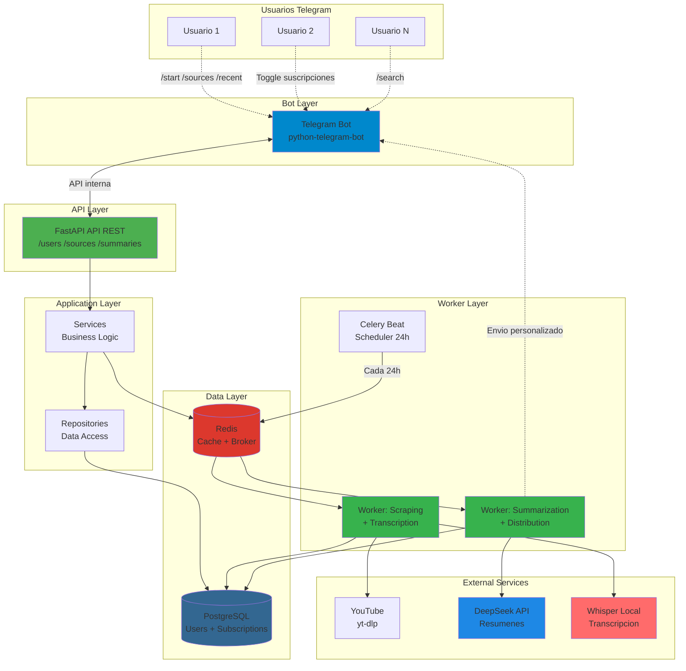
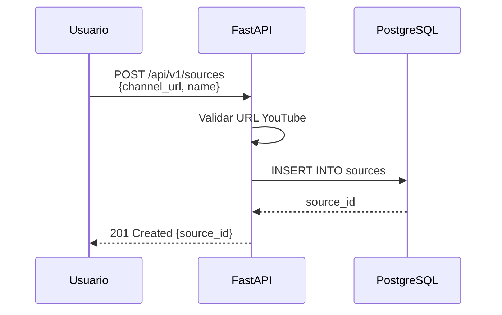
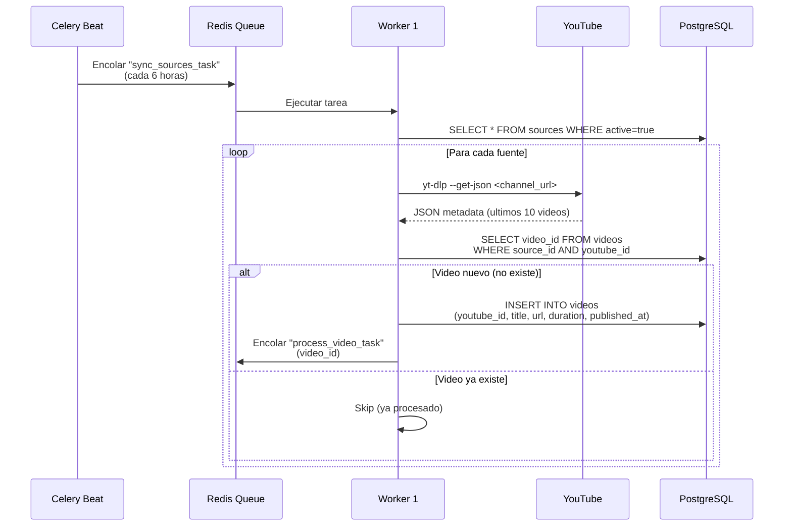
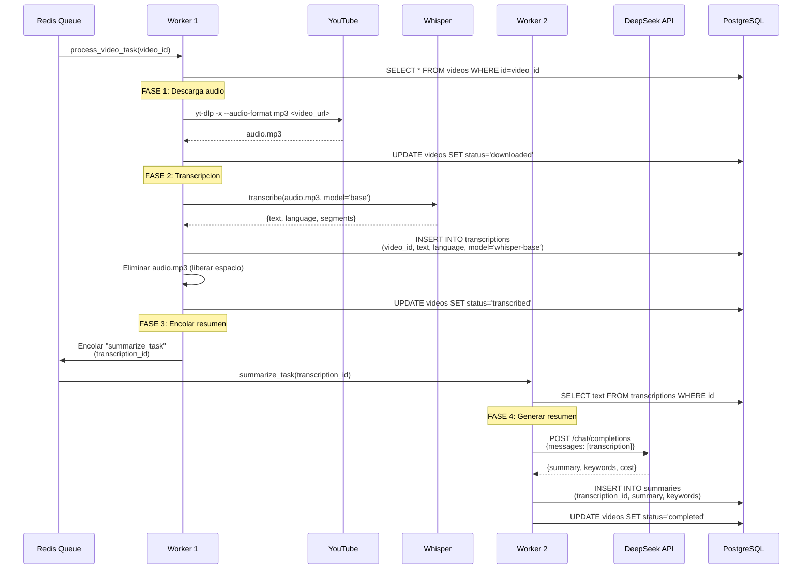
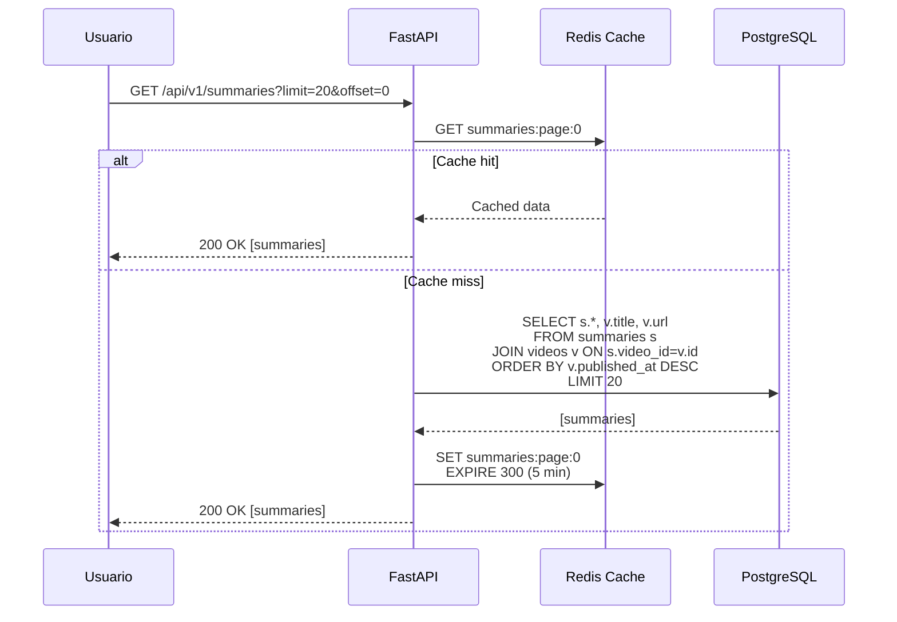
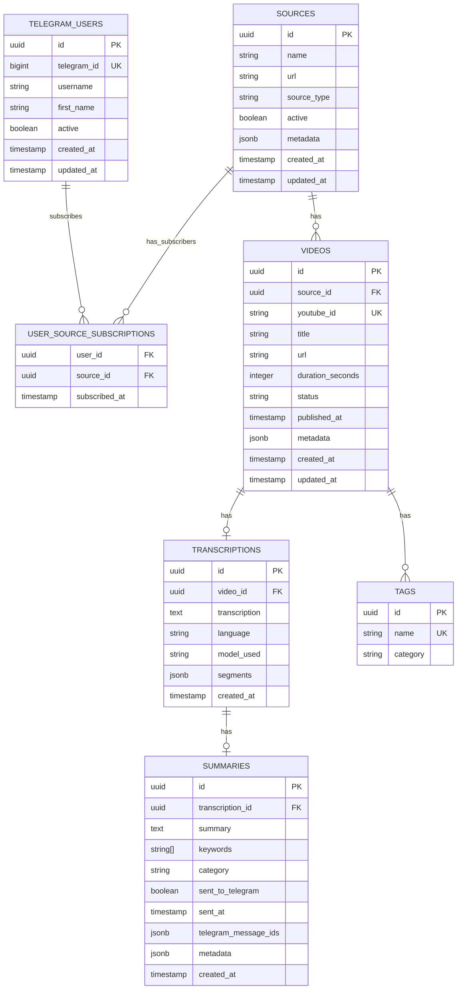

# ARQUITECTURA - IA MONITOR

**Version:** 1.0
**Fecha:** Octubre 2025
**Autor:** Prodelaya

---

## RESUMEN EJECUTIVO

**Proyecto:** Agregador inteligente de contenido sobre IA en desarrollo software con bot de Telegram multi-usuario
**Objetivo dual:**
- **Utilidad real:** Bot de Telegram interactivo donde cada usuario elige sus canales
- **Portfolio profesional:** Demostrar backend Python moderno con IA funcional y arquitectura multi-usuario

**Stack core:** FastAPI + PostgreSQL + Redis + Celery + Whisper (local) + DeepSeek API + Telegram Bot (python-telegram-bot)
**Deployment:** Servidor local HP EliteDesk 800 G2 con Cloudflare Tunnel
**Presupuesto:** $0 (todo gratuito/local)
**Usuarios:** Multi-usuario con preferencias individuales de suscripción a canales

---

## INDICE

1. [Infraestructura](#infraestructura)
2. [Stack Tecnologico](#stack-tecnologico)
3. [Arquitectura del Sistema](#arquitectura-del-sistema)
4. [Flujos de Procesamiento](#flujos-de-procesamiento)
5. [Modelo de Datos](#modelo-de-datos)
6. [Estructura de Directorios](#estructura-de-directorios)
7. [Plan de Escalabilidad](#plan-de-escalabilidad)
8. [ADRs (Decisiones Arquitectonicas)](#adrs)

---

## INFRAESTRUCTURA

### Servidor: HP EliteDesk 800 G2 DM

| Componente         | Especificacion                           | Estado       | Notas                                |
| ------------------ | ---------------------------------------- | ------------ | ------------------------------------ |
| **CPU**            | Intel Core i5-6500T (4c/4t, 2.5-3.1 GHz) | ✅ Suficiente | Adecuado para Whisper base           |
| **RAM**            | 8 GB DDR4 2133 MHz                       | ⚠️ Ajustado   | Ampliable a 32GB (~$40)              |
| **Storage**        | 256 GB NVMe SSD Samsung                  | ✅ Suficiente | ~10GB proyecto + ~50GB videos temp   |
| **SO**             | Ubuntu 24.04 LTS x86-64                  | ✅ Ideal      | Mismo stack que desarrollo           |
| **Red**            | Cloudflare Tunnel configurado            | ✅ Operativo  | Exposicion web segura sin IP publica |
| **Disponibilidad** | 24/7 siempre encendido                   | ✅ OK         | Necesario para jobs programados      |

**Veredicto:** Servidor VIABLE para MVP. Path de upgrade economico disponible.

### Capacidad de procesamiento estimada

**Carga de trabajo esperada:**
- Volumen: 5-20 videos/dia
- Duracion promedio: 10-30 minutos
- Total diario: 100-400 minutos de audio

**Rendimiento Whisper base (sin GPU):**
- Velocidad: ~2x tiempo real
- 20 videos de 20 min = 400 min audio = ~13 horas procesamiento
- Procesamiento nocturno: 22:00 - 08:00 (10 horas disponibles)

**Conclusion:** Capacidad suficiente para volumen esperado. Picos requieren cola.

---

## STACK TECNOLOGICO

### 1. Backend: FastAPI

**Comparativa de frameworks:**

| Aspecto               | FastAPI                  | Flask                  | Django         |
| --------------------- | ------------------------ | ---------------------- | -------------- |
| **Performance**       | ⭐⭐⭐⭐⭐ Async nativo       | ⭐⭐⭐ WSGI sync          | ⭐⭐⭐ WSGI sync  |
| **Documentacion API** | ✅ Auto (Swagger/OpenAPI) | ❌ Manual               | ⭐ DRF          |
| **Curva aprendizaje** | ⭐⭐⭐⭐ Similar a Flask     | ⭐⭐⭐⭐⭐ Muy simple       | ⭐⭐ Complejo    |
| **Validacion datos**  | ✅ Pydantic integrado     | ❌ Requires marshmallow | ✅ Django Forms |
| **Ecosistema async**  | ✅ Nativo                 | ⚠️ Via extensiones      | ⚠️ Desde 3.1+   |
| **Peso**              | ⭐⭐⭐⭐⭐ Ligero             | ⭐⭐⭐⭐⭐ Minimo           | ⭐⭐ Pesado      |

**Decision:** FastAPI
- ✅ Async nativo (necesario para I/O intensivo: descargas, transcripciones, APIs)
- ✅ Documentacion automatica (portfolio profesional)
- ✅ Validacion con Pydantic (menos bugs)
- ✅ Performance superior (importante para API publica)

### 2. Database: PostgreSQL

**Comparativa de bases de datos:**

| Aspecto                | PostgreSQL        | MySQL          | MongoDB          | SQLite        |
| ---------------------- | ----------------- | -------------- | ---------------- | ------------- |
| **Transacciones ACID** | ✅ Completas       | ✅ Completas    | ⚠️ Limitadas      | ✅ Basicas     |
| **JSON nativo**        | ✅ JSONB indexable | ⭐ JSON basico  | ✅ Nativo         | ❌ No          |
| **Full-text search**   | ✅ Potente         | ⭐ Basico       | ⭐ Via Atlas      | ❌ Limitado    |
| **Concurrencia**       | ⭐⭐⭐⭐⭐ MVCC        | ⭐⭐⭐⭐ Row-level | ⭐⭐⭐⭐ Document    | ⭐⭐ File-level |
| **Escalabilidad**      | ⭐⭐⭐⭐ Excelente    | ⭐⭐⭐⭐ Buena     | ⭐⭐⭐⭐⭐ Horizontal | ⭐ Local only  |
| **Recursos (8GB RAM)** | ⭐⭐⭐⭐ ~500MB       | ⭐⭐⭐⭐ ~400MB    | ⭐⭐⭐ ~800MB       | ⭐⭐⭐⭐⭐ ~50MB   |

**Decision:** PostgreSQL
- ✅ JSONB para metadatos flexibles (transcripciones, API responses)
- ✅ Full-text search para busqueda en resumenes
- ✅ Relaciones complejas (sources → videos → transcriptions → summaries)
- ✅ Experiencia previa del desarrollador
- ✅ Production-ready para futuro escalado

### 3. Cache: Redis

**Comparativa de sistemas de cache:**

| Aspecto               | Redis                 | Memcached  | Local (dict)    |
| --------------------- | --------------------- | ---------- | --------------- |
| **Persistencia**      | ✅ Opcional            | ❌ No       | ❌ RAM volatil   |
| **Estructuras datos** | ✅ Lists, Sets, Hashes | ❌ Solo K-V | ⭐ Python nativo |
| **Pub/Sub**           | ✅ Si                  | ❌ No       | ❌ No            |
| **Broker Celery**     | ✅ Nativo              | ❌ No       | ❌ No            |
| **Recursos**          | ~100MB                | ~50MB      | ~0MB            |

**Decision:** Redis
- ✅ Doble proposito: cache + broker Celery (un servicio, dos funciones)
- ✅ Cache de metadatos de videos
- ✅ Pub/Sub para notificaciones en tiempo real (futuro)

### 4. Task Queue: Celery

**Comparativa de sistemas async:**

| Aspecto               | Celery                | FastAPI BackgroundTasks | RQ               | Dramatiq             |
| --------------------- | --------------------- | ----------------------- | ---------------- | -------------------- |
| **Complejidad setup** | ⭐⭐⭐ Media             | ⭐⭐⭐⭐⭐ Cero              | ⭐⭐⭐⭐ Simple      | ⭐⭐⭐ Media            |
| **Scheduling**        | ✅ Celery Beat         | ❌ Requires APScheduler  | ❌ Requires extra | ✅ Si                 |
| **Monitoring**        | ✅ Flower              | ❌ Manual                | ⭐ RQ Dashboard   | ⭐ Dramatiq Dashboard |
| **Reintentos**        | ✅ Configurables       | ⭐ Manual                | ✅ Si             | ✅ Si                 |
| **Larga duracion**    | ✅ Ideal               | ❌ No recomendado        | ✅ Si             | ✅ Si                 |
| **Maduro**            | ✅ 2009, battle-tested | ✅ Nativo FastAPI        | ⭐ 2011           | ⭐ 2016               |

**Decision:** Celery
- ✅ Tareas largas (transcripcion 5-20 min por video)
- ✅ Scheduling nativo (Celery Beat para scraping cada 6h)
- ✅ Reintentos automaticos (APIs pueden fallar)
- ✅ Monitoring con Flower (observabilidad)
- ✅ Escalable (multiples workers en paralelo)

### 5. IA: Whisper (local) + DeepSeek API

**Comparativa transcripcion:**

| Servicio                  | Coste       | Precision | Velocidad     | Idiomas |
| ------------------------- | ----------- | --------- | ------------- | ------- |
| **Whisper base (local)**  | $0          | 85-90%    | 2x realtime   | 99      |
| **Whisper small (local)** | $0          | 90-95%    | 3x realtime   | 99      |
| AssemblyAI                | $0.006/min  | 95%+      | 0.2x realtime | 10+     |
| Deepgram                  | $0.0043/min | 95%+      | 0.1x realtime | 30+     |
| Google Speech-to-Text     | $0.006/min  | 95%+      | 0.3x realtime | 125     |

**Decision:** Whisper base (local)
- ✅ $0 coste (requisito del proyecto)
- ✅ Precision suficiente para resumenes (no necesitamos subtitulos perfectos)
- ✅ Sin limites de uso
- ✅ Privacidad (no enviamos audio a terceros)
- ⚠️ Consume ~1.5GB RAM (dentro del limite con 8GB)
- ⚠️ Lento pero aceptable (procesamiento nocturno)

**Comparativa resumenes:**

| Servicio              | Coste            | Limite     | Calidad         |
| --------------------- | ---------------- | ---------- | --------------- |
| **DeepSeek**          | $0.28/1M input   | Sin limite | ⭐⭐⭐⭐ Buena      |
| OpenAI GPT-4          | $0.03/1K tokens  | Sin limite | ⭐⭐⭐⭐⭐ Excelente |
| Claude API            | $0.015/1K tokens | Sin limite | ⭐⭐⭐⭐⭐ Excelente |
| LangChain + local LLM | $0               | Ilimitado  | ⭐⭐⭐ Variable    |

**Decision:** DeepSeek API
- ✅ Coste predecible: ~$0.16-0.45/mes para 300 videos
- ✅ Sin limites artificiales de uso
- ✅ Compatible con SDK OpenAI (facil integracion)
- ✅ Context caching automatico (reduce costos 80%)
- ✅ JSON output nativo (estructurado)

---

## ARQUITECTURA DEL SISTEMA

### Diagrama de componentes



### Descripcion de componentes

**1. Bot Layer (Telegram Bot)**
- Bot interactivo multi-usuario con python-telegram-bot
- Commands: /start, /sources, /recent, /search, /help
- Inline keyboards para toggle de suscripciones
- Envío personalizado de resúmenes según preferencias de usuario
- Consumidor de API REST interna

**2. API Layer (FastAPI)**
- Endpoints REST para consultar resumenes filtrados por usuario
- Endpoints para gestionar fuentes (canales YouTube)
- Endpoints para gestionar usuarios y suscripciones
- Documentacion auto-generada (Swagger)
- CORS configurado para frontend (opcional futuro)

**3. Application Layer**
- **Services:** Logica de negocio (orquestacion de workers, validaciones, distribucion)
- **Repositories:** Abstraccion de acceso a datos (patron Repository)

**4. Data Layer**
- **PostgreSQL:** Datos estructurados (users, sources, videos, transcriptions, summaries, subscriptions)
- **Redis:** Cache de metadatos + broker de Celery + rate limiting

**5. Worker Layer**
- **Worker 1:** Scraping canales, descarga audio, transcripcion con Whisper
- **Worker 2:** Resumenes con DeepSeek, distribucion personalizada a usuarios suscritos
- **Celery Beat:** Scheduler para scraping periodico (cada 24h)

**6. External Services**
- **YouTube:** API + yt-dlp para obtener metadatos y descargar audio
- **Whisper:** Modelo local para transcripcion
- **DeepSeek:** LLM API para generar resumenes

---

## FLUJOS DE PROCESAMIENTO

### Flujo 1: Registro de nueva fuente (manual)



### Flujo 2: Scraping periodico (automatico)



### Flujo 3: Procesamiento de video (async)



### Flujo 4: Consulta API (usuario)



---

## MODELO DE DATOS

### Diagrama ER



### Descripcion de tablas

**1. telegram_users**
- Usuarios del bot de Telegram (multi-usuario)
- `telegram_id`: ID único de Telegram (bigint, indexado)
- `username`: @username de Telegram (opcional)
- `first_name`: Nombre del usuario en Telegram
- `active`: Si el usuario tiene notificaciones activas (puede pausar)
- **Relación M:N con sources** via user_source_subscriptions

**2. user_source_subscriptions**
- Tabla intermedia para relación M:N (usuarios ↔ sources)
- Cada usuario puede suscribirse a múltiples canales
- Cada canal puede tener múltiples suscriptores
- `subscribed_at`: Timestamp de cuándo se suscribió

**3. sources**
- Fuentes de contenido (canales YouTube)
- `source_type`: 'youtube' (futuro: 'rss', 'podcast')
- `active`: Permite desactivar fuentes sin borrarlas
- `metadata`: Datos extra (subscriber_count, thumbnail_url, etc.)

**4. videos**
- Videos individuales obtenidos de las fuentes
- `youtube_id`: ID unico de YouTube (para evitar duplicados)
- `title`: Título del video (para mostrar en Telegram)
- `url`: Link directo al video de YouTube (para enviar en mensajes)
- `status`: 'pending' → 'downloading' → 'downloaded' → 'transcribing' → 'transcribed' → 'summarizing' → 'completed' | 'failed'
- `duration_seconds`: Para estimar tiempo de procesamiento
- `metadata`: Datos extra (view_count, like_count, thumbnail_url, etc.)

**5. transcriptions**
- Transcripciones generadas por Whisper
- `model_used`: 'whisper-base' | 'whisper-small' (para tracking)
- `segments`: JSON con timestamps (futuro: busqueda temporal)

**6. summaries**
- Resumenes generados por DeepSeek
- `keywords`: Array de palabras clave extraidas
- `category`: 'framework' | 'language' | 'tool' | 'concept'
- `sent_to_telegram`: Flag de si ya fue enviado
- `sent_at`: Timestamp de envío a Telegram
- `telegram_message_ids`: JSON mapeando user_id → message_id (para reenvíos)
- `metadata`: Datos extra del API (tokens, cost, etc.)

**7. tags**
- Etiquetas para clasificacion (relacion N:M con videos)
- `category`: 'framework' | 'language' | 'tool' | 'concept'

### Indices principales

```sql
-- Telegram users (queries frecuentes)
CREATE UNIQUE INDEX idx_telegram_users_telegram_id ON telegram_users(telegram_id);
CREATE INDEX idx_telegram_users_active ON telegram_users(active);

-- Subscriptions (M:N queries)
CREATE INDEX idx_subscriptions_user_id ON user_source_subscriptions(user_id);
CREATE INDEX idx_subscriptions_source_id ON user_source_subscriptions(source_id);
CREATE UNIQUE INDEX idx_subscriptions_unique ON user_source_subscriptions(user_id, source_id);

-- Performance critico
CREATE INDEX idx_videos_source_id ON videos(source_id);
CREATE INDEX idx_videos_status ON videos(status);
CREATE INDEX idx_videos_published_at ON videos(published_at DESC);
CREATE INDEX idx_transcriptions_video_id ON transcriptions(video_id);
CREATE INDEX idx_summaries_transcription_id ON summaries(transcription_id);
CREATE INDEX idx_summaries_sent_to_telegram ON summaries(sent_to_telegram);

-- Full-text search
CREATE INDEX idx_summaries_summary_fts ON summaries USING gin(to_tsvector('spanish', summary));
CREATE INDEX idx_videos_title_fts ON videos USING gin(to_tsvector('spanish', title));

-- Compound indexes para queries complejas
CREATE INDEX idx_videos_source_status ON videos(source_id, status);
CREATE INDEX idx_summaries_category ON summaries(category) WHERE category IS NOT NULL;
```

## ESTRUCTURA DE DIRECTORIOS

```
youtube-AIsummary/
├── .github/
│   └── workflows/
│       ├── ci.yml                  # Tests + linting
│       └── cd.yml                  # Deployment automatico
│
├── docs/
│   ├── architecture.md             # Este documento
│   ├── api.md                      # Documentacion endpoints
│   ├── deployment.md               # Guia de despliegue
│   ├── ADR/                        # Architecture Decision Records
│   │   ├── 001-fastapi-vs-flask.md
│   │   ├── 002-whisper-local.md
│   │   └── 003-apyhub-limit.md
│   ├── contexting-prompts/         # Prompts de contexto
│   └── professional-prompts/       # Prompts de desarrollo
│
├── src/
│   ├── __init__.py
│   │
│   ├── api/                        # FastAPI application
│   │   ├── __init__.py
│   │   ├── main.py                 # App factory
│   │   ├── dependencies.py         # DI containers
│   │   ├── routes/
│   │   │   ├── __init__.py
│   │   │   ├── summaries.py        # GET /api/v1/summaries
│   │   │   ├── sources.py          # CRUD /api/v1/sources
│   │   │   └── health.py           # GET /health
│   │   └── schemas/                # Pydantic models
│   │       ├── __init__.py
│   │       ├── summary.py
│   │       ├── source.py
│   │       └── common.py
│   │
│   ├── core/                       # Configuracion central
│   │   ├── __init__.py
│   │   ├── config.py               # Settings (Pydantic BaseSettings)
│   │   ├── database.py             # SQLAlchemy engine + session
│   │   ├── redis.py                # Redis connection
│   │   ├── celery_app.py           # Celery instance
│   │   └── logging.py              # Logging config
│   │
│   ├── models/                     # SQLAlchemy ORM models
│   │   ├── __init__.py
│   │   ├── base.py                 # Base model + mixins
│   │   ├── source.py
│   │   ├── video.py
│   │   ├── transcription.py
│   │   ├── summary.py
│   │   └── tag.py
│   │
│   ├── repositories/               # Data access layer
│   │   ├── __init__.py
│   │   ├── base.py                 # Generic CRUD
│   │   ├── source_repository.py
│   │   ├── video_repository.py
│   │   ├── transcription_repository.py
│   │   └── summary_repository.py
│   │
│   ├── services/                   # Business logic
│   │   ├── __init__.py
│   │   ├── youtube_service.py      # yt-dlp wrapper
│   │   ├── whisper_service.py      # Transcription
│   │   ├── summarization_service.py # DeepSeek summarization
│   │   └── cache_service.py        # Redis cache
│   │
│   ├── tasks/                      # Celery tasks
│   │   ├── __init__.py
│   │   ├── sync_sources.py         # Scraping periodico
│   │   ├── process_video.py        # Pipeline completo
│   │   ├── transcribe.py           # Whisper task
│   │   └── summarize.py            # DeepSeek task
│   │
│   └── utils/                      # Utilidades
│       ├── __init__.py
│       └── validators.py           # Validaciones custom
│
├── tests/
│   ├── __init__.py
│   ├── conftest.py                 # Fixtures pytest
│   ├── unit/
│   │   ├── test_services.py
│   │   └── test_repositories.py
│   ├── integration/
│   │   ├── test_api.py
│   │   └── test_tasks.py
│   └── e2e/
│       └── test_full_pipeline.py
│
├── migrations/                     # Alembic migrations
│   ├── versions/
│   └── env.py
│
├── scripts/
│   ├── setup_dev.sh                # Setup entorno desarrollo
│   ├── deploy.sh                   # Deployment produccion
│   ├── backup_db.sh                # Backup PostgreSQL
│   └── seed_data.py                # Datos de prueba
│
├── .env                            # Variables entorno (NO commitear)
├── .env.example                    # Template variables
├── .gitignore
├── README.md
├── LICENSE
├── pyproject.toml                  # Poetry dependencies
├── poetry.lock
├── docker-compose.yml              # Dev environment
├── docker-compose.prod.yml         # Production
├── Dockerfile
└── alembic.ini                     # Config migraciones
```

---

## PLAN DE ESCALABILIDAD

### Etapa 1: MVP (actual - 8GB RAM)

**Capacidad:**
- 5-10 videos/dia
- Whisper base (1.5GB RAM)
- Procesamiento secuencial

**Limitaciones:**
- RAM ajustada (~6.8GB disponible)
- CPU al 100% durante transcripcion
- Sin redundancia

**Cuando escalar:** >10 videos/dia consistente O RAM >90%

---

### Etapa 2: Upgrade RAM (8GB → 16GB) [~$40]

**Mejoras:**
- ✅ Whisper small (mejor precision 90-95%)
- ✅ 2 workers Celery en paralelo
- ✅ Capacidad: 15-20 videos/dia
- ✅ PostgreSQL con mas buffer pool

**Trigger:** Volumen >10 videos/dia por 1 semana

---

### Etapa 3: Upgrade RAM (16GB → 32GB) [~$80 total]

**Mejoras:**
- ✅ Whisper medium (precision 95%+)
- ✅ 4 workers Celery en paralelo
- ✅ Capacidad: 30-50 videos/dia
- ✅ Cache Redis mas grande

**Trigger:** Volumen >20 videos/dia por 1 semana

---

### Etapa 4: Arquitectura hibrida (Servidor + Oracle Cloud)

**Cuando:** >50 videos/dia O CPU saturada constantemente

**Distribucion:**
```
Servidor Local (HP EliteDesk):
- FastAPI (API REST)
- PostgreSQL (base de datos)
- Redis (cache + broker)
- Celery Beat (scheduler)
- Celery Worker (resumenes ApyHub)

Oracle Cloud Always Free (4 OCPUs ARM + 24GB):
- Celery Worker dedicado (transcripciones Whisper)
- Whisper large model (precision 98%+)
- Procesamiento 4x mas rapido (ARM optimizado)
```

**Ventajas:**
- ✅ Separa I/O (servidor) de CPU intensivo (cloud)
- ✅ $0 coste (Oracle Always Free)
- ✅ Capacidad: 100+ videos/dia

**Complejidad:** +2 semanas setup (VPN, queue distribuida, monitoring)

---

### Etapa 5: Cloud completo (si crece mucho)

**Solo si:** >200 videos/dia O necesitas SLA 99.9%

**Stack:**
- Hetzner VPS (~$10/mes, 4 vCPUs + 8GB)
- Managed PostgreSQL (~$15/mes)
- Autoscaling workers (Kubernetes)

**No recomendado a corto plazo:** Overkill para caso de uso actual

---

## ADRS (DECISIONES ARQUITECTONICAS)

### ADR-001: FastAPI vs Flask

**Contexto:**
Necesitamos un framework web para exponer API REST. Opciones: FastAPI, Flask, Django.

**Decision:** FastAPI

**Razon:**
- Async nativo (I/O bound: descargas, APIs externas)
- Documentacion auto-generada (portfolio profesional)
- Validacion Pydantic (menos bugs, mejor DX)
- Performance superior (benchmarks: 2-3x Flask)

**Consecuencias:**
- ✅ Codigo mas mantenible
- ✅ Testing mas facil (TestClient integrado)
- ⚠️ Curva aprendizaje async/await (mitigado: similar a Flask)

---

### ADR-002: Whisper local vs APIs pago

**Contexto:**
Necesitamos transcribir audio de videos. Opciones: Whisper local, AssemblyAI, Deepgram.

**Decision:** Whisper base (local)

**Razon:**
- $0 coste (requisito del proyecto)
- Precision suficiente para resumenes (85-90%)
- Sin limites de uso
- Privacidad (no enviamos audio a terceros)

**Trade-offs:**
- ✅ Coste: $0 vs $2.40/dia (400 min × $0.006/min)
- ⚠️ Velocidad: 2x realtime vs 0.2x realtime (10x mas lento)
- ⚠️ RAM: 1.5GB vs 0GB
- ✅ Precision: 85-90% vs 95%+ (suficiente para caso de uso)

**Consecuencias:**
- ✅ Proyecto viable con presupuesto $0
- ⚠️ Procesamiento nocturno requerido (no real-time)
- 📋 Path de migracion: Si crece, usar AssemblyAI o Whisper large en Oracle Cloud

---

### ADR-003: Sistema de resúmenes con DeepSeek (histórico)

**Contexto histórico:**
Originalmente se evaluó ApyHub API (límite 5 llamadas/día) pero resultó insuficiente para volumen esperado (10 videos/día).

**Decisión final:** Migrar a DeepSeek API (ADR-009)
- DeepSeek: $0.28/1M tokens, sin límites artificiales
- Presupuesto: $10 (suficiente para ~2-5 años)
- No requiere sistema de rate limiting complejo

**Alternativas descartadas:**
- ❌ ApyHub: Insuficiente (5 llamadas/día)
- ❌ OpenAI GPT-4o-mini: Más caro ($0.15/1M tokens)

**Consecuencias:**
- ✅ Arquitectura simplificada (sin sistema de colas complejas)
- ✅ Escalabilidad real sin bloqueantes
- ✅ Ver ADR-009 para detalles de implementación

---

### ADR-004: PostgreSQL vs MongoDB

**Contexto:**
Necesitamos persistir datos estructurados (sources, videos, summaries). Opciones: PostgreSQL, MongoDB.

**Decision:** PostgreSQL

**Razon:**
- Relaciones claras (source → videos → transcriptions → summaries)
- JSONB para flexibilidad en metadatos
- Full-text search nativo (busqueda en resumenes)
- Transacciones ACID (importante para estado de procesamiento)
- Experiencia previa del desarrollador

**Consecuencias:**
- ✅ Consultas relacionales eficientes
- ✅ Migraciones con Alembic (cambios de schema controlados)
- ⚠️ Menos flexible que MongoDB (mitigado con JSONB)

---

### ADR-005: Celery vs FastAPI BackgroundTasks

**Contexto:**
Necesitamos procesar tareas pesadas en background. Opciones: Celery, BackgroundTasks, RQ.

**Decision:** Celery + Celery Beat

**Razon:**
- Tareas largas (transcripcion 5-20 min)
- Scheduling nativo (scraping cada 6h)
- Reintentos automaticos
- Monitoring con Flower
- Escalable (multiples workers)

**Trade-off:**
- ⚠️ Complejidad: Requiere Redis + worker process
- ✅ Beneficio: Produccion-ready, battle-tested

**Consecuencias:**
- ✅ API responde inmediato (no bloquea)
- ✅ Jobs programados sin cron
- ⚠️ +1 dia setup inicial (mitigado: bien documentado)

---

### ADR-006: Cloudflare Tunnel vs Nginx + Certbot

**Contexto:**
Necesitamos exponer API al exterior. Servidor detras de NAT sin IP publica.

**Decision:** Cloudflare Tunnel (ya configurado)

**Razon:**
- ✅ Ya operativo (sin cambios)
- ✅ HTTPS automatico
- ✅ Sin abrir puertos en router
- ✅ DDoS protection gratis
- ✅ Capa extra de seguridad (WAF)

**Consecuencias:**
- ✅ Deployment simplificado
- ✅ Monitoreo trafico en Cloudflare dashboard
- ⚠️ Dependencia externa (mitigado: Cloudflare SLA 99.99%)

---

### ADR-007: Deployment en servidor local vs Cloud

**Contexto:**
Donde desplegar el proyecto. Opciones: Servidor local, Oracle Cloud, Hetzner VPS.

**Decision:** Servidor local (HP EliteDesk)

**Razon:**
- ✅ Hardware disponible (no requiere compra)
- ✅ $0 coste operativo
- ✅ 24/7 disponible
- ✅ Suficiente para volumen esperado (5-20 videos/dia)
- ✅ Path de escalado claro (RAM upgrade → Oracle Cloud)

**Consecuencias:**
- ✅ Proyecto arranca inmediatamente
- ✅ Aprendizaje deployment real (Docker, systemd)
- ⚠️ Sin redundancia (mitigado: backups diarios)
- 📋 Futuro: Arquitectura hibrida si volumen crece

---
# ADR-008: Conservar transcripciones indefinidamente en MVP

**Contexto:**
Las transcripciones son generadas por Whisper y consumidas por ApyHub para generar resúmenes.
Necesitamos decidir si conservarlas o eliminarlas después del resumen.

**Decisión:** Conservar transcripciones indefinidamente

**Razón:**
- Costo de almacenamiento despreciable (~18MB/año para 10 videos/día)
- Útil para debugging si resúmenes son de baja calidad
- Habilita features futuras (búsqueda full-text, análisis temporal)
- Simplicidad: no requiere lógica adicional de limpieza

**Trade-offs:**
- ✅ Espacio: ~18MB/año vs 0MB (diferencia insignificante)
- ✅ Features: Búsqueda en transcripciones vs solo resúmenes
- ✅ Implementación: 0 líneas código vs tarea de limpieza

**Consecuencias:**
- ✅ MVP más simple
- ✅ Flexibilidad para analytics avanzado
- ⚠️ Migrar a borrado automático si BD crece excesivamente (>50K videos)

**Path de migración:**
Si en el futuro necesitamos optimizar espacio, implementar Estrategia 3
(borrado diferido con retención de 30 días).

---

### ADR-009: Migración de ApyHub a DeepSeek

**Contexto:**
ApyHub limita a 5 llamadas/día en plan gratuito. Volumen esperado: 10 videos/día (300/mes).

**Decisión:** DeepSeek API con modelo `deepseek-chat`

**Razón:**
- ApyHub insuficiente (5 llamadas vs 10 videos diarios)
- DeepSeek: $0.28/1M tokens input + $0.42/1M output
- Costo mensual: ~$0.16-0.45 (con context caching)
- Sin límites artificiales de uso
- Compatible OpenAI SDK (migración simple)

**Trade-offs:**
- ✅ Costo: $0.45/mes vs límite bloqueante
- ✅ Escalabilidad: ilimitado vs 5/día
- ✅ Simplicidad: API síncrona vs job polling
- ⚠️ Requiere sistema de prompts (LLM genérico)

**Consecuencias:**
- ✅ Proyecto viable para caso de uso real
- ✅ Código más simple (~150 líneas vs ~480)
- ✅ Context caching reduce costos 80% tras primer resumen
- 📋 Implementar prompt engineering para calidad óptima

**Alternativas descartadas:**
- ❌ Mantener ApyHub: Insuficiente para producción
- ❌ GPT-4o-mini: Más caro ($0.15/1M tokens)
- ❌ Claude API: Más caro ($0.015/1K tokens)

---

### ADR-010: Bot de Telegram interactivo vs Canal broadcast

**Contexto:**
Necesitamos distribuir resúmenes a usuarios. Opciones: Canal Telegram unidireccional vs Bot interactivo multi-usuario.

**Decisión:** Bot interactivo multi-usuario con suscripciones personalizables

**Razón:**
- ✅ Cada usuario elige sus canales de interés (personalización)
- ✅ Comandos interactivos (/recent, /search, /sources)
- ✅ Inline keyboards para toggle de suscripciones (UX mejorada)
- ✅ API REST justificada (backend del bot)
- ✅ Multi-usuario real = portfolio profesional robusto
- ✅ Escalable (1 usuario → 100 usuarios sin cambios)
- ✅ Histórico accesible bajo demanda

**Trade-offs:**
- ✅ Funcionalidad: Multi-usuario vs broadcast simple
- ⚠️ Complejidad: +2 días desarrollo (modelo TelegramUser + endpoints)
- ⚠️ BD: +2 tablas (telegram_users, user_source_subscriptions)
- ✅ UX: Interactivo vs pasivo (mejor experiencia usuario)

**Consecuencias:**
- ✅ Proyecto útil para múltiples personas (no solo el desarrollador)
- ✅ Arquitectura escalable y profesional
- ✅ API REST con propósito claro (no "por si acaso")
- 📝 Requiere bot commands completos + inline keyboards
- 📝 Worker de distribución personalizada por suscripciones

**Formato de mensajes Telegram:**
```
📹 Título: "FastAPI async mistakes you're making"
🔗 Link: https://youtube.com/watch?v=abc123
⏱️ Duración: 15:32
🏷️ Tags: #FastAPI #Python #async

📝 Resumen:
[Texto del resumen generado por DeepSeek]

💬 /reenviar_abc123
```

---

### ADR-011: Repositories síncronos vs asíncronos

**Contexto:**
Necesitamos implementar Repository Pattern. Principal uso: Celery workers (síncronos), API REST (ocasional).

**Decisión:** Repositories SÍNCRONOS con `Session`

**Razón:**
- ✅ Celery workers son 99% del uso de BD (síncronos por diseño)
- ✅ API REST: <10 req/día (uso ocasional, no requiere async)
- ✅ Implementación más simple y rápida (2 días vs 4 días)
- ✅ SQLAlchemy ORM funciona mejor en modo sync
- ✅ Tests más simples (fixtures síncronos)
- ✅ Sin migración de `database.py` a `AsyncSession`
- ✅ Menos riesgo de bugs (stack maduro)

**Trade-offs:**
- ✅ Tiempo: 2 días vs 4 días async
- ✅ Complejidad: Baja vs Alta
- ⚠️ Throughput: ~1000 req/s vs ~2000 req/s (irrelevante para <10 req/día)
- ✅ Beneficio async: 0% para este caso de uso

**Consecuencias:**
- ✅ Desarrollo rápido y sin complicaciones
- ✅ Compatible con Celery workers existentes
- ✅ API endpoints usan `def` en lugar de `async def` (aceptable)
- 📝 Path de migración: Si carga API crece a >500 req/s, migrar a async

**Ejemplo de uso:**
```python
# Worker Celery (principal uso)
@shared_task
def distribute_summary(summary_id: str):
    db = SessionLocal()
    try:
        summary_repo = SummaryRepository(db)
        user_repo = TelegramUserRepository(db)
        # ... lógica
    finally:
        db.close()

# Endpoint API (uso ocasional)
@router.get("/summaries")
def get_summaries(db: Session = Depends(get_db)):
    repo = SummaryRepository(db)
    return repo.list_all(limit=20)
```

---

### ADR-012: Orquestador del Pipeline (VideoProcessingService)

**Contexto:**
Necesitamos coordinar el flujo completo: URL → Metadata → Download → Transcribe → Summarize → Cleanup. Decisiones clave: arquitectura sync/async, gestión de estados, manejo de errores, persistencia incremental.

**Decisión:** Orquestador 100% async con commits intermedios y gestión inteligente de archivos

**Razón:**

**1. Arquitectura 100% Async (vs Sync o Híbrida)**
- ✅ Preparado para Celery async tasks (roadmap paso 15)
- ✅ No bloquea event loop en FastAPI endpoints
- ✅ Mejor performance con I/O intensivo (descarga, API calls)
- ✅ Integración natural con servicios async (DeepSeek API)
- ⚠️ Servicios sync (yt-dlp, Whisper) ya son async en capa de servicio

**2. Commits Intermedios (vs Transacción única)**
- ✅ Preserva trabajo costoso (transcripción = 5-8 min)
- ✅ Si falla resumen, transcripción queda guardada → retry barato
- ✅ Mejor observabilidad (estados intermedios visibles en BD)
- ⚠️ No es atómico (puede quedar en estado intermedio si crash)
- ✅ Trade-off aceptable: costo de re-transcripción >> inconsistencia

**3. Máquina de Estados Completa**
```
pending → downloading → downloaded → transcribing → transcribed →
summarizing → completed

En cada paso puede ir a 'failed' si hay error
```
- ✅ Estados granulares para debugging
- ✅ Restart solo desde 'failed' (safe)
- ✅ No se puede reprocesar 'completed' (previene duplicados)
- ✅ Transiciones registradas en logs estructurados

**4. Gestión Inteligente de Archivos MP3**
- ✅ Borrar al completar con éxito → libera espacio rápido
- ✅ Borrar en error de descarga/red → no acumula basura
- ✅ **Mantener en error de transcripción** → debugging (Whisper puede tardar 8 min)
- ✅ Borrar en error de resumen → transcripción ya guardada en BD
- ✅ Cleanup en finally block → garantiza limpieza cuando corresponde

**5. Logging Estructurado con Contexto**
```python
logger.info(
    "video_processing_started",
    extra={
        "video_id": str(video.id),
        "youtube_id": video.youtube_id,
        "url": video.url,
        "status": video.status.value,
    }
)
```
- ✅ Contexto completo en cada log (video_id siempre presente)
- ✅ Métricas en cada fase (file_size, duration, tokens_used)
- ✅ Formato estructurado → fácil parseo con ELK/Loki
- ✅ Niveles apropiados (INFO para pasos, ERROR para fallos)

**Trade-offs:**

| Aspecto | Elegido | Alternativa | Por qué |
|---------|---------|-------------|---------|
| **Async** | 100% async | Sync con asyncio.run() | Preparado para Celery, mejor integración |
| **Commits** | Intermedios | Transacción única | Preserva trabajo costoso (transcripción) |
| **Estados** | 7 estados granulares | 3 estados simples | Mejor observabilidad y debugging |
| **Archivos** | Borrar condicional | Siempre borrar / Nunca borrar | Balance espacio/debugging |
| **Retry** | Manual desde 'failed' | Automático en servicio | Usuario decide cuándo reintentar |

**Consecuencias:**

✅ **Positivas:**
- Pipeline robusto con manejo completo de errores
- Progreso incremental preservado en BD
- Archivos temporales gestionados eficientemente
- Logs estructurados para observabilidad
- 93% coverage con 17 tests (11 unit + 6 integration)
- Preparado para Celery tasks

⚠️ **Negativas/Trade-offs:**
- Más complejo que orquestador sync simple
- Estados intermedios pueden quedar huérfanos si crash del sistema
- Necesita limpieza manual de archivos antiguos en /tmp

📝 **Implementación:**
- Archivo: `src/services/video_processing_service.py` (115 líneas)
- Método principal: `async def process_video(session, video_id) -> Video`
- Métodos privados: `_download_audio()`, `_transcribe_audio()`, `_create_summary()`, `_cleanup_audio_file()`
- Excepciones: `VideoNotFoundError`, `InvalidVideoStateError` (heredan de `VideoProcessingError`)

**Flujo implementado:**
```python
1. Validar video existe y status in {PENDING, FAILED}
2. Download: PENDING → DOWNLOADING → DOWNLOADED (commit)
3. Transcribe: → TRANSCRIBING → crear Transcription → TRANSCRIBED (commit)
4. Summarize: → SUMMARIZING → crear Summary → COMPLETED (commit)
5. Cleanup: borrar MP3 si corresponde
6. Error: → FAILED (commit), cleanup condicional, reraise
```

**Métricas de calidad:**
- Tests: 17/17 passing (11 unit + 6 integration)
- Coverage: 93% del servicio
- Integración BD: Validada con transacciones reales
- Error handling: Testeos de fallo en cada fase

**Path de migración futura:**
- ✅ Añadir retry automático con exponential backoff (Paso 15)
- ✅ Integrar con Celery async tasks (Paso 14)
- ✅ Dashboard de monitoreo de pipeline (Paso 16)
- ✅ Limpieza automática de archivos antiguos (cron job)

---

## METRICAS Y OBSERVABILIDAD

**Prometheus metrics:**
- `videos_processed_total`: Counter de videos procesados
- `transcription_duration_seconds`: Histogram de tiempo de transcripcion
- `deepseek_api_calls_total`: Counter de llamadas a DeepSeek
- `deepseek_cost_usd`: Gauge de costo acumulado ($)
- `celery_task_duration_seconds`: Histogram por tipo de tarea
- `api_request_duration_seconds`: Histogram de latencia API

**Grafana dashboards:**
1. Overview: Videos/dia, tiempo procesamiento, tasa error
2. Resources: CPU, RAM, Disk I/O
3. API: Request rate, latency p50/p95/p99, errores
4. Celery: Tasks pending, processing, failed

**Alertas criticas:**
- RAM >85% por 5 min
- Disco <20GB libre
- Costo DeepSeek >$1/día (anomalía)
- Tasa error Celery >10%

---

## SEGURIDAD

**Proteccion de secretos:**
- `.env` en `.gitignore` (NUNCA commitear)
- Variables de entorno en produccion (systemd EnvironmentFile)
- Tokens en Cloudflare Secrets (futuro: Vault)

**API Security:**
- CORS configurado (whitelist dominios)
- Rate limiting (10 req/s por IP)
- JWT authentication (futuro)
- Input validation (Pydantic)

**Database:**
- Usuario no-root con permisos minimos
- Conexion via Unix socket (no TCP)
- Backups cifrados con GPG

---

## TESTING

**Cobertura objetivo:** 80%+

**Estrategia:**
1. **Unit tests:** Services, repositories (mocks)
2. **Integration tests:** API endpoints (TestClient + DB test)
3. **E2E tests:** Pipeline completo (fixture videos cortos)

**Fixtures:**
- Video corto (30s) para testing transcripcion
- Transcripcion pre-generada para testing resumenes
- Base de datos test (Docker container ephemeral)

---

## DOCUMENTACION

**Documentacion tecnica:**
- Este documento (architecture.md)
- API docs (auto-generada Swagger)
- ADRs para decisiones importantes
- Deployment guide (step-by-step)

**Documentacion usuario:**
- README con quickstart
- API usage examples
- Telegram bot commands (futuro)

---

## TIMELINE DE IMPLEMENTACION

Ver [docs/roadmap.md](roadmap.md) para roadmap detallado con pasos incrementales (4 semanas estimadas).

---

## REFERENCIAS

- FastAPI docs: https://fastapi.tiangolo.com
- Celery docs: https://docs.celeryq.dev
- Whisper repo: https://github.com/openai/whisper
- DeepSeek API docs: https://api-docs.deepseek.com/
- PostgreSQL docs: https://www.postgresql.org/docs

---

**Documento vivo:** Este documento se actualiza conforme evoluciona el proyecto.

**Proxima revision:** Despues de implementar Fase 1 (Infraestructura Base)
