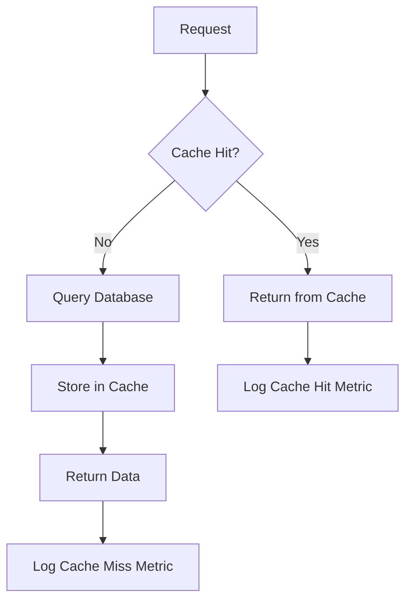
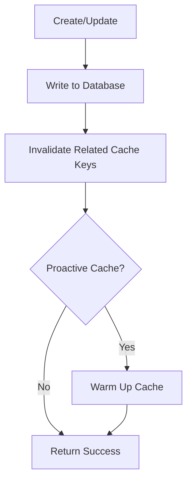

# Estrategia de Caché con Redis - YouTube AI Summary

## 📋 Índice

1. [Visión General](#visión-general)
2. [Arquitectura de Caché](#arquitectura-de-caché)
3. [Decisiones de Diseño](#decisiones-de-diseño)
4. [Claves y Estructuras de Datos](#claves-y-estructuras-de-datos)
5. [Políticas de TTL](#políticas-de-ttl)
6. [Estrategias de Invalidación](#estrategias-de-invalidación)
7. [Fallback y Resiliencia](#fallback-y-resiliencia)
8. [Métricas y Monitoreo](#métricas-y-monitoreo)

---

## 🎯 Visión General

### Objetivos

- **Reducir latencia:** Mejorar tiempos de respuesta de API y Bot de Telegram en 3-5x
- **Reducir carga en PostgreSQL:** Disminuir queries repetitivas en resúmenes frecuentes
- **Optimizar recursos:** Usar caché inteligente para servidor con recursos limitados (8GB RAM, i5-6500T)
- **Mantener datos frescos:** Balance entre performance y actualización de datos

### Alcance

**En Scope:**
- Resúmenes individuales (lectura intensiva)
- Listas de resúmenes recientes por usuario
- Resultados de búsqueda full-text
- Estadísticas globales del sistema
- Estadísticas por fuente

**Out of Scope:**
- Transcripciones completas (muy grandes, poco reutilizables)
- Datos de videos individuales (bajo hit rate esperado)
- Datos de usuarios de Telegram (bajo volumen, alta actualización)
- Suscripciones (datos críticos, requieren consistencia inmediata)

---

## 🏗️ Arquitectura de Caché

### Capa de Abstracción

```
┌─────────────────────────────────────────┐
│   API REST / Bot Telegram / Workers    │
└──────────────────┬──────────────────────┘
                   │
┌──────────────────▼──────────────────────┐
│         CacheService (Abstracción)      │
│  - get(key)         - get_or_set()      │
│  - set(key, val)    - invalidate()      │
│  - delete(key)      - get_many()        │
└──────────────────┬──────────────────────┘
                   │
       ┌───────────┴───────────┐
       │                       │
┌──────▼───────┐       ┌───────▼──────┐
│  Redis Cache │       │  PostgreSQL  │
│  (Hot Data)  │       │  (Cold Data) │
└──────────────┘       └──────────────┘
```

### Flujo de Lectura (Read-Through Cache)



### Flujo de Escritura (Cache-Aside + Invalidation)



---

## 🧠 Decisiones de Diseño

### 1. Patrón: Cache-Aside + Read-Through

**Decisión:** Usar patrón híbrido Cache-Aside para escrituras y Read-Through para lecturas.

**Justificación:**
- **Cache-Aside:** Control explícito sobre qué cachear en escrituras
- **Read-Through:** Transparencia en lecturas, simplifica código del repository
- **Invalidación proactiva:** Garantiza consistencia en operaciones críticas

**Alternativas Rechazadas:**
- ❌ **Write-Through:** Overhead innecesario, mayoría de datos se leen múltiples veces antes de actualizarse
- ❌ **Write-Behind:** Riesgo de pérdida de datos en servidor con recursos limitados

### 2. Serialización: JSON

**Decisión:** Usar JSON para serialización de objetos Python.

**Justificación:**
- ✅ Compatible con múltiples lenguajes (futuro frontend)
- ✅ Human-readable para debugging
- ✅ Soportado nativamente por Redis (JSON strings)
- ⚠️ Overhead aceptable para tamaño de datos (<10KB por resumen)

**Alternativas Rechazadas:**
- ❌ **Pickle:** No portable, riesgo de seguridad, no human-readable
- ❌ **MessagePack:** Mejor performance pero no human-readable

### 3. Base de Datos Redis: Separada (DB 1)

**Decisión:** Usar Redis DB 1 para caché (DB 0 para Celery broker).

**Justificación:**
- ✅ Aislamiento lógico: caché vs. mensajería
- ✅ Facilita flushing de caché sin afectar Celery
- ✅ Métricas separadas por namespace
- ⚠️ Misma instancia Redis (límite de memoria compartido)

**Configuración:**
```bash
REDIS_URL=redis://localhost:6379/0          # Celery Broker
REDIS_CACHE_URL=redis://localhost:6379/1    # Cache Layer
```

### 4. TTL: Conservador (5-24h)

**Decisión:** TTLs cortos a medios para balance freshness/performance.

**Justificación:**
- Contenido mayormente estático (resúmenes no cambian)
- Listas dinámicas requieren TTL corto (nuevo contenido frecuente)
- Recursos limitados → evitar memory pressure con TTL largo

### 5. Fallback: Graceful Degradation

**Decisión:** Sistema funciona sin caché si Redis no disponible.

**Justificación:**
- ✅ Resiliencia ante fallos de Redis
- ✅ Permite mantenimiento sin downtime
- ⚠️ Performance degradado pero funcionalidad intacta

**Implementación:**
```python
try:
    cached = cache_service.get(key)
    if cached:
        return cached
except RedisConnectionError:
    logger.warning("Redis unavailable, falling back to database")

# Fallback to DB
return database_query()
```

---

## 🔑 Claves y Estructuras de Datos

### Nomenclatura de Claves

**Formato:** `{namespace}:{entity}:{identifier}:{suffix}`

**Ejemplos:**
```
summary:detail:550e8400-e29b-41d4-a716-446655440000
user:12345:recent
search:a1b2c3d4:results
stats:global
stats:source:550e8400-e29b-41d4-a716-446655440000
```

### Tipos de Claves

#### 1. Resúmenes Individuales

**Key:** `summary:detail:{summary_id}`

**Tipo Redis:** String (JSON serializado)

**Estructura:**
```json
{
  "id": "550e8400-e29b-41d4-a716-446655440000",
  "transcription_id": "660e8400-e29b-41d4-a716-446655440001",
  "summary_text": "FastAPI es un framework moderno...",
  "category": "framework",
  "keywords": ["fastapi", "python", "async"],
  "model_used": "deepseek-chat",
  "sent_to_telegram": true,
  "created_at": "2025-01-15T10:30:00Z",
  "sent_at": "2025-01-15T10:35:00Z"
}
```

**TTL:** 24 horas (86400s)

**Justificación:** Contenido estático, alta probabilidad de reutilización

---

#### 2. Listas de Resúmenes Recientes por Usuario

**Key:** `user:{telegram_id}:recent`

**Tipo Redis:** String (JSON array de summary_ids)

**Estructura:**
```json
{
  "summary_ids": [
    "550e8400-e29b-41d4-a716-446655440000",
    "660e8400-e29b-41d4-a716-446655440001",
    "770e8400-e29b-41d4-a716-446655440002"
  ],
  "generated_at": "2025-01-15T10:30:00Z",
  "total_count": 10
}
```

**TTL:** 5 minutos (300s)

**Justificación:** Datos dinámicos (nuevos resúmenes frecuentes), comando frecuente en bot

**Optimización:** Solo IDs en caché, resúmenes completos se cachean individualmente

---

#### 3. Resultados de Búsqueda Full-Text

**Key:** `search:{query_hash}:results`

**Tipo Redis:** String (JSON array de summary_ids + metadata)

**Estructura:**
```json
{
  "query": "FastAPI async",
  "query_hash": "a1b2c3d4e5f6",
  "summary_ids": [
    "550e8400-e29b-41d4-a716-446655440000",
    "660e8400-e29b-41d4-a716-446655440001"
  ],
  "total_results": 25,
  "cached_at": "2025-01-15T10:30:00Z"
}
```

**Query Hash:** MD5 de query normalizada (lowercase, whitespace trimmed)

**TTL:** 10 minutos (600s)

**Justificación:** Resultados semi-estáticos, búsquedas repetidas comunes

**Límite:** Solo primeros 50 resultados cacheados (resto desde DB)

---

#### 4. Estadísticas Globales del Sistema

**Key:** `stats:global`

**Tipo Redis:** Hash

**Estructura:**
```redis
HSET stats:global total_videos 1250
HSET stats:global total_transcriptions 980
HSET stats:global total_summaries 950
HSET stats:global total_sources 15
HSET stats:global total_telegram_users 42
HSET stats:global last_updated "2025-01-15T10:30:00Z"
```

**TTL:** 15 minutos (900s)

**Justificación:** Estadísticas cambian gradualmente, queries costosas (COUNT(*))

---

#### 5. Estadísticas por Fuente

**Key:** `stats:source:{source_id}`

**Tipo Redis:** Hash

**Estructura:**
```redis
HSET stats:source:550e8400 total_videos 85
HSET stats:source:550e8400 total_transcriptions 82
HSET stats:source:550e8400 total_summaries 80
HSET stats:source:550e8400 avg_duration_seconds 1245
HSET stats:source:550e8400 last_updated "2025-01-15T10:30:00Z"
```

**TTL:** 15 minutos (900s)

**Justificación:** Estadísticas específicas de fuente para dashboard

---

## ⏰ Políticas de TTL

### Matriz de Decisión TTL

| Tipo de Dato | TTL | Justificación | Tasa de Cambio | Hit Rate Esperado |
|--------------|-----|---------------|----------------|-------------------|
| **Resúmenes individuales** | 24h | Contenido estático, no cambia | Muy baja | >80% |
| **Listas de recientes (usuario)** | 5 min | Nuevos resúmenes frecuentes | Alta | ~60% |
| **Resultados de búsqueda** | 10 min | Semi-estáticos, queries repetidas | Media | ~70% |
| **Estadísticas globales** | 15 min | Cambios graduales, queries costosas | Media-baja | >85% |
| **Estadísticas por fuente** | 15 min | Cambios graduales por fuente | Media-baja | >75% |

### Trade-offs por Tipo

#### Resúmenes Individuales (24h)

**Pros:**
- ✅ Máximo hit rate
- ✅ Mínima carga en DB
- ✅ Contenido no cambia (append-only)

**Contras:**
- ⚠️ Si se corrige un resumen, tardará 24h en reflejarse
- **Mitigación:** Invalidación manual vía endpoint admin

---

#### Listas de Recientes (5 min)

**Pros:**
- ✅ Balance entre freshness y performance
- ✅ Nuevos resúmenes visibles en <5 min

**Contras:**
- ⚠️ Hit rate moderado (~60%)
- ⚠️ Más cache churn (invalidaciones frecuentes)

**Alternativas Consideradas:**
- 1 minuto: Demasiado cache churn, hit rate <30%
- 15 minutos: Usuarios esperan contenido más fresco

---

#### Búsquedas (10 min)

**Pros:**
- ✅ Queries frecuentes cacheadas (ej: "FastAPI", "Python")
- ✅ Reduce carga en full-text search de PostgreSQL

**Contras:**
- ⚠️ Nuevos resúmenes no aparecen hasta 10 min después
- **Mitigación:** Invalidar caché de búsquedas populares al crear resumen

---

## 🔄 Estrategias de Invalidación

### Eventos que Gatillan Invalidación

| Evento | Claves a Invalidar | Estrategia | Prioridad |
|--------|-------------------|------------|-----------|
| **Crear resumen** | `user:*:recent`, `search:*:results`, `stats:*` | Invalidar listas | Alta |
| **Actualizar resumen** | `summary:detail:{id}`, `search:*:results` | Invalidar específico + búsquedas | Media |
| **Borrar resumen (soft delete)** | `summary:detail:{id}`, `user:*:recent`, `search:*:results` | Invalidar todo relacionado | Alta |
| **Cambiar estado de video** | `stats:global`, `stats:source:{id}` | Invalidar estadísticas | Baja |
| **Usuario se suscribe/desuscribe** | `user:{telegram_id}:recent` | Invalidar lista de ese usuario | Media |

### Implementación de Invalidación

#### 1. Invalidación Específica (Resumen Individual)

```python
def invalidate_summary(summary_id: UUID) -> None:
    """Invalida caché de un resumen específico."""
    cache_service.delete(f"summary:detail:{summary_id}")
    logger.info(f"Cache invalidated for summary {summary_id}")
```

**Cuándo:** Al actualizar o borrar un resumen

---

#### 2. Invalidación por Patrón (Listas de Usuario)

```python
def invalidate_user_recents(telegram_id: int | None = None) -> None:
    """Invalida listas de recientes (todos los usuarios o uno específico)."""
    if telegram_id:
        cache_service.delete(f"user:{telegram_id}:recent")
    else:
        # Invalidar todas las listas de usuarios
        cache_service.invalidate_pattern("user:*:recent")

    logger.info(f"Cache invalidated for user recents: {telegram_id or 'all'}")
```

**Cuándo:** Al crear nuevo resumen (todos) o al cambiar suscripciones (específico)

**⚠️ Advertencia:** `invalidate_pattern()` usa `KEYS` de Redis, bloqueante en producción.

**Alternativa para producción:** Mantener Set de telegram_ids activos y iterar.

---

#### 3. Invalidación de Búsquedas (Selectiva)

```python
def invalidate_search_cache(keywords: list[str] | None = None) -> None:
    """Invalida caché de búsquedas (todas o queries relacionadas con keywords)."""
    if keywords:
        # Invalidar solo búsquedas que contienen estos keywords
        for keyword in keywords:
            hash_key = _hash_query(keyword)
            cache_service.delete(f"search:{hash_key}:results")
    else:
        # Invalidar todas las búsquedas
        cache_service.invalidate_pattern("search:*:results")

    logger.info(f"Cache invalidated for searches: {keywords or 'all'}")
```

**Cuándo:** Al crear resumen con keywords populares (proactivo) o manualmente (admin)

**Optimización:** Lista de "keywords populares" en config para invalidación selectiva

---

#### 4. Invalidación de Estadísticas (Lazy)

```python
def invalidate_stats(source_id: UUID | None = None) -> None:
    """Invalida estadísticas globales y/o de fuente específica."""
    cache_service.delete("stats:global")

    if source_id:
        cache_service.delete(f"stats:source:{source_id}")
    else:
        cache_service.invalidate_pattern("stats:source:*")

    logger.info(f"Cache invalidated for stats: {source_id or 'all'}")
```

**Cuándo:** Al cambiar estado de video/transcripción/resumen

**Estrategia:** No invalidar inmediatamente, dejar expirar (TTL 15 min)

**Excepción:** Endpoint admin puede forzar invalidación

---

### Hooks de Invalidación en Repository

**Ejemplo en `SummaryRepository`:**

```python
def create(self, summary: Summary) -> Summary:
    """Crea resumen e invalida caché relacionado."""
    # Crear en DB
    created_summary = super().create(summary)

    # Invalidar caché
    cache_service.invalidate_pattern("user:*:recent")  # Listas de usuarios
    cache_service.invalidate_pattern("search:*:results")  # Búsquedas
    cache_service.delete("stats:global")  # Estadísticas

    # Log de invalidación
    logger.info(
        f"Cache invalidated after creating summary {created_summary.id}",
        extra={"summary_id": str(created_summary.id)}
    )

    return created_summary
```

---

## 🛡️ Fallback y Resiliencia

### Estrategia de Degradación Graceful

**Principio:** Sistema funciona sin caché, con performance degradado.

#### Niveles de Resiliencia

```python
# Nivel 1: Redis disponible → Usar caché normal
try:
    cached = cache_service.get(key)
    if cached:
        return cached
except RedisConnectionError:
    logger.warning("Redis unavailable, falling back to DB")

# Nivel 2: Redis lento → Timeout corto (100ms)
except RedisTimeoutError:
    logger.warning("Redis timeout, falling back to DB")

# Nivel 3: Cualquier error Redis → Continuar sin caché
except Exception as e:
    logger.error(f"Unexpected cache error: {e}", exc_info=True)

# Fallback: Query directa a BD
return database_query()
```

---

### Health Check de Redis

**Endpoint:** `GET /health/redis`

**Implementación:**
```python
def check_redis_health() -> dict:
    """Verifica estado de Redis."""
    try:
        start = time.time()
        redis_client.ping()
        latency_ms = (time.time() - start) * 1000

        return {
            "status": "healthy",
            "latency_ms": round(latency_ms, 2),
            "memory_used_mb": redis_client.info("memory")["used_memory"] / 1024 / 1024
        }
    except Exception as e:
        return {
            "status": "unhealthy",
            "error": str(e)
        }
```

**Alertas:**
- ⚠️ Latency >50ms → Warning
- ❌ Latency >200ms → Critical
- ❌ Redis down → Critical

---

### Circuit Breaker (Opcional - Fase 2)

**Concepto:** Desactivar caché automáticamente si Redis falla repetidamente.

**Implementación Futura:**
```python
class CacheCircuitBreaker:
    def __init__(self, failure_threshold=5, timeout=60):
        self.failure_count = 0
        self.failure_threshold = failure_threshold
        self.timeout = timeout
        self.last_failure_time = None
        self.state = "closed"  # closed, open, half-open

    def is_open(self) -> bool:
        if self.state == "open":
            if time.time() - self.last_failure_time > self.timeout:
                self.state = "half-open"
                return False
            return True
        return False

    def record_success(self):
        self.failure_count = 0
        self.state = "closed"

    def record_failure(self):
        self.failure_count += 1
        self.last_failure_time = time.time()
        if self.failure_count >= self.failure_threshold:
            self.state = "open"
            logger.warning("Circuit breaker OPEN: Redis disabled temporarily")
```

---

## 📊 Métricas y Monitoreo

### Métricas de Prometheus

#### Contadores

```python
from prometheus_client import Counter

cache_hits = Counter(
    'cache_hits_total',
    'Total cache hits',
    ['cache_type']  # summary, user_recent, search, stats
)

cache_misses = Counter(
    'cache_misses_total',
    'Total cache misses',
    ['cache_type']
)

cache_errors = Counter(
    'cache_errors_total',
    'Total cache operation errors',
    ['error_type']  # connection, timeout, serialization
)
```

#### Histogramas

```python
from prometheus_client import Histogram

cache_operation_duration = Histogram(
    'cache_operation_seconds',
    'Duration of cache operations',
    ['operation']  # get, set, delete, invalidate
)

cache_value_size = Histogram(
    'cache_value_size_bytes',
    'Size of cached values',
    ['cache_type'],
    buckets=[100, 500, 1000, 5000, 10000, 50000]
)
```

#### Gauges

```python
from prometheus_client import Gauge

cache_keys_count = Gauge(
    'cache_keys_total',
    'Total number of keys in cache',
    ['cache_type']
)

redis_memory_used = Gauge(
    'redis_memory_used_bytes',
    'Redis memory usage in bytes'
)
```

---

### Cálculo de Cache Hit Rate

**Fórmula:**
```python
cache_hit_rate = cache_hits / (cache_hits + cache_misses)
```

**Objetivo:** >70% hit rate global

**Hit Rates Esperados por Tipo:**
- Resúmenes individuales: >80%
- Listas de recientes: ~60%
- Búsquedas: ~70%
- Estadísticas: >85%

---

### Dashboard de Monitoreo (Grafana - Paso 23)

**Paneles a crear:**

1. **Cache Hit Rate (Global y por Tipo)**
   - Gráfica de línea temporal
   - Objetivo: >70% línea horizontal

2. **Cache Operations Duration**
   - Histograma de latencias
   - Objetivo: p95 <10ms

3. **Redis Memory Usage**
   - Gauge con límite 256MB
   - Alerta si >200MB (80%)

4. **Cache Errors**
   - Counter de errores por tipo
   - Alerta si >10 errores/min

5. **Cache Keys Count**
   - Distribución por tipo
   - Detectar memory leaks

---

### Logs Estructurados

**Ejemplo de log de cache hit:**
```json
{
  "timestamp": "2025-01-15T10:30:00Z",
  "level": "INFO",
  "message": "Cache hit",
  "cache_type": "summary",
  "key": "summary:detail:550e8400-e29b-41d4-a716-446655440000",
  "duration_ms": 2.5
}
```

**Ejemplo de log de cache miss:**
```json
{
  "timestamp": "2025-01-15T10:30:05Z",
  "level": "INFO",
  "message": "Cache miss, querying database",
  "cache_type": "summary",
  "key": "summary:detail:660e8400-e29b-41d4-a716-446655440001",
  "duration_ms": 45.2
}
```

---

## 🧪 Testing de Caché

### Categorías de Tests

#### 1. Tests Unitarios (`tests/services/test_cache_service.py`)

**Cobertura:**
- Serialización/deserialización JSON
- TTL correcto en `set()`
- `get()` retorna None si key no existe
- `delete()` elimina key correctamente
- `get_or_set()` ejecuta fetcher solo en miss
- Manejo de errores Redis

**Mocks:**
- Redis client mockeado (no Redis real)

---

#### 2. Tests de Integración (`tests/repositories/test_summary_cache.py`)

**Cobertura:**
- `get_by_id()` usa caché en segunda llamada
- `create()` invalida caché de listas
- `soft_delete()` invalida caché de resumen
- Fallback a DB si Redis no disponible
- Invalidación por patrón funciona

**Requerimientos:**
- Redis real en DB 15 (test DB)
- Flush DB antes de cada test

---

#### 3. Tests E2E (`tests/api/test_cache_headers.py`)

**Cobertura:**
- Endpoint `/summaries/{id}` retorna header `X-Cache-Status: HIT`
- Header `X-Cache-Bypass: true` fuerza lectura de DB
- Endpoint `/summaries/recent` cachea respuesta completa
- Bot `/recent` usa caché en segunda llamada

**Requerimientos:**
- API corriendo
- Redis corriendo
- DB con datos de prueba

---

#### 4. Tests de Performance (`tests/performance/test_query_optimization.py`)

**Cobertura:**
- Benchmark de endpoint sin caché (baseline)
- Benchmark de endpoint con caché (mejora esperada 3-5x)
- Benchmark de queries N+1 antes/después eager loading
- Métricas de cache hit rate bajo carga

**Herramientas:**
- `pytest-benchmark` para mediciones
- `locust` para carga concurrente (opcional)

---

## 📈 Roadmap de Optimización

### Fase 1: Implementación Base (Paso 19 - Actual)

- ✅ CacheService con métodos básicos
- ✅ Cache en SummaryRepository
- ✅ Cache en endpoints API
- ✅ Cache en Bot de Telegram
- ✅ Métricas de Prometheus
- ✅ Tests >85% coverage

### Fase 2: Optimizaciones Avanzadas (Post-Paso 19)

- Cache de relaciones (eager loading + cache)
- Cache de agregaciones (top keywords, trending topics)
- Cache warming proactivo (precarga de datos populares)
- Circuit breaker para Redis
- Compresión de valores grandes (gzip)

### Fase 3: Escalabilidad (Futuro)

- Redis Cluster (sharding)
- Cache distribuido (múltiples instancias)
- Cache L2 (in-memory local + Redis remoto)
- Cache de CDN para API pública

---

## 🔧 Comandos de Debugging

### Inspeccionar Keys en Redis

```bash
# Conectar a Redis cache DB
redis-cli -n 1

# Listar todas las keys
KEYS *

# Listar keys de resúmenes
KEYS summary:detail:*

# Listar keys de usuarios
KEYS user:*:recent

# Ver contenido de key
GET summary:detail:550e8400-e29b-41d4-a716-446655440000

# Ver TTL de key
TTL summary:detail:550e8400-e29b-41d4-a716-446655440000

# Ver info de memoria
INFO memory

# Contar keys por patrón
KEYS summary:* | wc -l
```

### Invalidar Caché Manualmente

```bash
# Invalidar resumen específico
redis-cli -n 1 DEL summary:detail:550e8400-e29b-41d4-a716-446655440000

# Invalidar todas las listas de recientes
redis-cli -n 1 --scan --pattern "user:*:recent" | xargs redis-cli -n 1 DEL

# Invalidar todas las búsquedas
redis-cli -n 1 --scan --pattern "search:*:results" | xargs redis-cli -n 1 DEL

# Flush completo del cache DB (¡CUIDADO!)
redis-cli -n 1 FLUSHDB
```

### Monitorear Operaciones en Tiempo Real

```bash
# Ver comandos en tiempo real
redis-cli -n 1 MONITOR

# Ver estadísticas de comandos
redis-cli -n 1 INFO stats

# Ver slowlog (comandos lentos)
redis-cli -n 1 SLOWLOG GET 10
```

---

## 📚 Referencias

- [Redis Best Practices](https://redis.io/docs/management/optimization/)
- [Cache Patterns](https://docs.aws.amazon.com/whitepapers/latest/database-caching-strategies-using-redis/caching-patterns.html)
- [PostgreSQL + Redis Architecture](https://www.postgresql.org/docs/current/redis-fdw.html)
- Documentación interna:
  - `docs/architecture.md` - Arquitectura general
  - `docs/clean-code.md` - Estándares de código
  - `CLAUDE.md` - Manifesto del proyecto

---

## ✅ Criterios de Aceptación - Paso 19

- [x] Documento de estrategia completo
- [ ] CacheService implementado con >85% coverage
- [ ] Cache integrado en SummaryRepository
- [ ] Cache en endpoints API con headers
- [ ] Cache en Bot de Telegram (/recent, /search)
- [ ] Queries N+1 optimizados con eager loading
- [ ] Métricas de Prometheus exportadas
- [ ] Benchmarks documentan mejora 3-5x
- [ ] Tests de resiliencia validan fallback
- [ ] Cache hit rate >70% validado

---

**Última actualización:** 2025-01-15
**Autor:** Pablo (prodelaya)
**Estado:** En desarrollo - Paso 19
