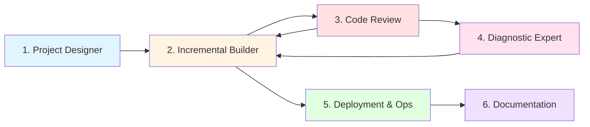

# 📘 GUÍA DE USO DE PROMPTS - CLAUDE SONNET 4.5

**VERSIÓN:** 1.0  
**ACTUALIZADO:** Octubre 2025

---

## 🎯 PROPÓSITO DE ESTA GUÍA

Esta guía te ayuda a **elegir el prompt correcto** para cada fase de tu proyecto y a **usarlos eficientemente** con Claude Sonnet 4.5.

**Los 6 prompts especializados cubren el ciclo completo de desarrollo:**



---

## 📋 TABLA DE DECISIÓN RÁPIDA

**¿Qué necesitas hacer ahora?**

| Si necesitas... | Usa este prompt | Tiempo estimado |
|----------------|-----------------|-----------------|
| 🏗️ **Diseñar arquitectura desde cero** | [1. Project Designer](#1-project-designer) | 30-60 min |
| 💻 **Implementar código paso a paso** | [2. Incremental Builder](#2-incremental-builder) | Variable según feature |
| 🔍 **Revisar código existente** | [3. Code Review](#3-code-review--refactor) | 15-30 min por módulo |
| 🐛 **Solucionar un bug o error** | [4. Diagnostic Expert](#4-diagnostic-expert) | 10-30 min |
| ⚡ **Optimizar rendimiento** | [4. Diagnostic Expert](#4-diagnostic-expert) | 20-60 min |
| 🚀 **Hacer deployment a producción** | [5. Deployment & Ops](#5-deployment--ops) | 1-3 horas (primera vez) |
| 📚 **Documentar o aprender algo** | [6. Documentation Mentor](#6-documentation-mentor) | Variable según tema |

---

## 🔄 FLUJOS DE TRABAJO COMUNES

### **Flujo 1: Nuevo Proyecto desde Cero**

```
┌─────────────────────────────────────────────────────────┐
│ FASE 1: DISEÑO (1 sesión)                              │
├─────────────────────────────────────────────────────────┤
│ 1. Usa "Project Designer"                              │
│    ├─ Define objetivo y restricciones                   │
│    ├─ Obtén recomendación de stack técnico             │
│    ├─ Revisa arquitectura propuesta                     │
│    └─ Aprueba roadmap de features                      │
└─────────────────────────────────────────────────────────┘
             ↓
┌─────────────────────────────────────────────────────────┐
│ FASE 2: IMPLEMENTACIÓN (2-6 semanas)                   │
├─────────────────────────────────────────────────────────┤
│ 2. Para cada feature, usa "Incremental Builder"        │
│    ├─ Implementa en pasos de <15 líneas                │
│    ├─ Prueba cada incremento                            │
│    └─ Valida funcionalidad antes de avanzar            │
└─────────────────────────────────────────────────────────┘
             ↓
┌─────────────────────────────────────────────────────────┐
│ FASE 3: CALIDAD (semanal)                              │
├─────────────────────────────────────────────────────────┤
│ 3. Cada semana, usa "Code Review"                      │
│    ├─ Revisa módulos implementados                      │
│    ├─ Refactoriza code smells                          │
│    └─ Mejora cobertura de tests                        │
└─────────────────────────────────────────────────────────┘
             ↓
┌─────────────────────────────────────────────────────────┐
│ FASE 4: DEPLOYMENT (1 vez, luego automatizado)         │
├─────────────────────────────────────────────────────────┤
│ 4. Usa "Deployment & Ops"                              │
│    ├─ Crea scripts de deployment                        │
│    ├─ Configura CI/CD                                  │
│    └─ Establece monitoreo                              │
└─────────────────────────────────────────────────────────┘
             ↓
┌─────────────────────────────────────────────────────────┐
│ FASE 5: DOCUMENTACIÓN (continuo)                       │
├─────────────────────────────────────────────────────────┤
│ 5. Usa "Documentation Mentor"                          │
│    ├─ Documenta arquitectura (ADRs)                    │
│    ├─ Crea guías de uso                                │
│    └─ Mantén README actualizado                        │
└─────────────────────────────────────────────────────────┘
```

---

### **Flujo 2: Debugging de Producción**

```
┌──────────────────────────────┐
│ 🚨 PROBLEMA EN PRODUCCIÓN    │
└──────────────────────────────┘
           ↓
    [Recolectar evidencias]
    • Logs de error
    • Stack traces
    • Métricas de performance
           ↓
┌──────────────────────────────┐
│ Usa "Diagnostic Expert"      │
├──────────────────────────────┤
│ 1. Analiza causas raíz       │
│ 2. Valida hipótesis          │
│ 3. Propone solución          │
└──────────────────────────────┘
           ↓
    [¿Es fix rápido?]
     ↓ SÍ         ↓ NO
     │            │
     │   ┌────────────────────┐
     │   │ Usa "Code Review"  │
     │   │ para refactor      │
     │   └────────────────────┘
     │            ↓
     └────────────┤
           ↓
┌──────────────────────────────┐
│ Usa "Incremental Builder"    │
│ para implementar fix          │
└──────────────────────────────┘
           ↓
    [Test en staging]
           ↓
┌──────────────────────────────┐
│ Usa "Deployment & Ops"       │
│ para hotfix a producción     │
└──────────────────────────────┘
```

---

### **Flujo 3: Optimización de Performance**

```
┌──────────────────────────────┐
│ ⚡ APP LENTA                 │
└──────────────────────────────┘
           ↓
┌──────────────────────────────┐
│ Usa "Diagnostic Expert"      │
├──────────────────────────────┤
│ 1. Mide baseline (antes)     │
│ 2. Identifica cuellos de     │
│    botella                   │
│ 3. Propone optimizaciones    │
└──────────────────────────────┘
           ↓
┌──────────────────────────────┐
│ Usa "Incremental Builder"    │
│ para implementar mejoras     │
│ (una por una)                │
└──────────────────────────────┘
           ↓
    [Medir mejora]
    ¿Suficiente?
     ↓ NO      ↓ SÍ
     │         │
     └─────┐   │
           ↓   │
    [Repetir]  │
           ↓   │
           └───┤
               ↓
┌──────────────────────────────┐
│ Usa "Documentation Mentor"   │
│ para documentar decisiones   │
│ de optimización              │
└──────────────────────────────┘
```

---

## 📖 GUÍA DETALLADA POR PROMPT

### **1. PROJECT DESIGNER**

#### **¿Cuándo usarlo?**
✅ Inicio de un proyecto nuevo
✅ Pivote importante de arquitectura
✅ Evaluación de tecnologías para nueva feature
✅ Necesitas justificar decisiones técnicas a stakeholders

❌ NO usar para: implementación de código, debugging, deployment

#### **¿Cómo usarlo?**

**Paso 1: Prepara contexto**
Antes de iniciar la conversación, ten claro:
- Objetivo del proyecto (1 frase)
- Restricciones (presupuesto, tiempo, stack obligatorio)
- Audiencia objetivo (usuarios finales, desarrolladores, etc.)

**Paso 2: Inicia conversación**
```
Hola Claude, voy a usar el prompt "Project Designer" para diseñar 
la arquitectura de [nombre proyecto].

[Pega aquí el contenido del prompt 1_Project_Designer.md]

Contexto del proyecto:
- Nombre: Sistema de gestión de inventario
- Objetivo: Automatizar control de stock para 5 tiendas
- Tipo: Web app con API REST
- Restricciones: Presupuesto bajo, desplegar en 2 meses, preferencia Python
```

**Paso 3: Interactúa iterativamente**
Claude te hará preguntas de aclaración (máximo 3). Respóndelas para afinar la propuesta.

**Paso 4: Revisa entregables**
Recibirás:
- 📊 Tabla comparativa de stacks con pros/contras
- 🏗️ Diagrama de arquitectura (Mermaid)
- 📂 Estructura de directorios sugerida
- 🎯 Roadmap de features priorizado

**Paso 5: Itera si es necesario**
```
Claude, la arquitectura propuesta se ve bien, pero necesito añadir 
autenticación con OAuth. ¿Cómo afecta esto al diseño?
```

#### **Salidas esperadas:**
- Artifact `text/markdown`: Documento completo de arquitectura
- Artifact `application/vnd.ant.mermaid`: Diagramas embebidos
- Checklist de próximos pasos

#### **Transición al siguiente prompt:**
Una vez aprobada la arquitectura:
```
Perfecto Claude, arquitectura aprobada. Ahora pasemos al 
"Incremental Builder" para implementar la Fase 1: autenticación básica.
```

---

### **2. INCREMENTAL BUILDER**

#### **¿Cuándo usarlo?**
✅ Implementar nueva feature
✅ Añadir funcionalidad a código existente
✅ Necesitas avanzar sin romper lo que funciona
✅ Quieres mantener visibilidad de cada cambio

❌ NO usar para: diseño inicial, código completo de una vez, refactors grandes

#### **¿Cómo usarlo?**

**Paso 1: Define el incremento**
```
Claude, voy a usar "Incremental Builder" para implementar:
Feature: Registro de usuarios con validación de email

[Pega el contenido del prompt 2_Incremental_Builder.md]

Archivos existentes:
- src/models/user.py (ya existe, vacío)
- src/api/routes/auth.py (no existe)

Lenguaje: Python 3.11
Framework: FastAPI
```

**Paso 2: Sigue el flujo paso a paso**
Claude te dará pasos incrementales. **IMPORTANTE:** No avances sin validar cada paso.

```
[Claude te da Paso 1: Modelo User]

Tú ejecutas:
pytest tests/test_user_model.py -v

Si pasa → Respondes:
"✅ Paso 1 funciona. Procede con Paso 2"

Si falla → Respondes:
"❌ Paso 1 falla con este error: [pegar error]. ¿Cómo lo arreglo?"
```

**Paso 3: Solicita solo fragmentos**
```
Claude, dame SOLO el bloque de código que modifica 
src/services/user_service.py, no el archivo completo.
```

**Paso 4: Usa artifacts solo cuando sea necesario**
Claude generará artifacts automáticamente si el código supera 20 líneas. Para cambios pequeños, recibirás bloques inline.

#### **Buenas prácticas:**
- ✅ Valida cada incremento con tests
- ✅ Haz commit después de cada paso funcional
- ✅ Si un paso falla, no avances hasta arreglarlo
- ❌ No pidas "el archivo completo" salvo que realmente lo necesites

#### **Transición a Code Review:**
Después de implementar 2-3 features:
```
Claude, ya implementé autenticación, CRUD de usuarios y permisos.
Pasemos a "Code Review" para revisar calidad antes de continuar.
```

---

### **3. CODE REVIEW & REFACTOR**

#### **¿Cuándo usarlo?**
✅ Después de implementar varias features
✅ Antes de merge a rama principal
✅ Código legado que necesitas entender/mejorar
✅ Code review de pull request

❌ NO usar para: debugging de errores (usa Diagnostic Expert), implementación nueva

#### **¿Cómo usarlo?**

**Paso 1: Proporciona código a revisar**

**Opción A: Pegar código directamente**
```
Claude, voy a usar "Code Review & Refactor".

[Pega el contenido del prompt 3_Code_Review_Refactor.md]

Código a analizar:
[pega el código aquí]

Contexto: Este módulo maneja pagos. El problema es que es difícil 
de mantener y a veces falla en producción.
```

**Opción B: Subir archivos**
- Arrastra archivos `.py`, `.js`, etc. al chat
- Claude usará `Filesystem:read_file` para leerlos

**Paso 2: Revisa análisis estructurado**
Recibirás:
- 🔴 Code smells por severidad (crítico → bajo)
- 📊 Métricas de complejidad
- 🛡️ Vulnerabilidades de seguridad
- 📈 Deuda técnica priorizada

**Paso 3: Implementa refactors en fases**
Claude te dará un plan de 4 fases:
1. **Fase 1:** Correcciones críticas de seguridad (HACER PRIMERO)
2. **Fase 2:** Simplificación de complejidad
3. **Fase 3:** Eliminación de duplicación
4. **Fase 4:** Mejoras de legibilidad

**Implementa fase por fase, validando tests entre cada una.**

**Paso 4: Valida que no rompiste nada**
```bash
# Después de cada fase
pytest tests/ -v
pytest --cov=src --cov-report=term-missing
```

#### **Preguntas útiles durante el proceso:**
```
- "¿Esta refactor puede esperar o es urgente?"
- "¿Qué riesgo tiene este cambio?"
- "¿Hay forma más simple de hacer esto?"
- "¿Tests existentes cubren este caso?"
```

#### **Transición a otros prompts:**
- Si encuentras un bug → **Diagnostic Expert**
- Si necesitas implementar cambios → **Incremental Builder**
- Si refactor completo → **Documentation Mentor** (documenta decisiones)

---

### **4. DIAGNOSTIC EXPERT**

#### **¿Cuándo usarlo?**
✅ Error en producción o desarrollo
✅ Tests fallando sin causa clara
✅ Performance degradada
✅ Comportamiento inesperado

❌ NO usar para: code review rutinario, implementación de features

#### **¿Cómo usarlo?**

**Paso 1: Recolecta evidencias**
Antes de contactar a Claude, ten:
- ✅ Mensaje de error completo (stack trace)
- ✅ Logs relevantes
- ✅ Pasos para reproducir
- ✅ Comportamiento esperado vs actual

**Paso 2: Inicia diagnóstico**
```
Claude, tengo un error en producción. Voy a usar "Diagnostic Expert".

[Pega el contenido del prompt 4_Diagnostic_Expert.md]

**Comportamiento esperado:**
Al hacer POST /api/orders con datos válidos, debería crear la orden 
y devolver 201.

**Comportamiento actual:**
Devuelve 500 Internal Server Error.

**Logs:**
[2025-10-12 15:30:45] ERROR in orders.py:45
AttributeError: 'NoneType' object has no attribute 'price'

**Código relacionado:**
[pega el código del endpoint y funciones llamadas]
```

**Paso 3: Sigue el proceso de diagnóstico**
Claude te dará:
1. **Árbol de hipótesis** (ordenadas por probabilidad)
2. **Tests de validación** para cada hipótesis
3. **Solución propuesta** con código corregido
4. **Explicación técnica** del por qué funciona

**Paso 4: Valida la solución**
```
[Claude propone solución]

Tú: Probé la solución y ahora funciona. ¿Por qué el código 
anterior fallaba?

[Claude explica la causa raíz]
```

#### **Para problemas de performance:**
```
Claude, el endpoint /dashboard tarda 8 segundos. Necesito optimizarlo.

Métricas actuales:
- 250 queries SQL por request
- Uso de memoria: 1.2 GB
- Sin cache implementado

[Pega código relevante]
```

Claude te dará:
- Identificación de cuellos de botella (N+1 queries, etc.)
- Solución optimizada con código
- Benchmark antes/después con métricas concretas

#### **Uso de herramientas:**
- Claude puede usar `web_search` si el error es de librería externa
- Para JavaScript, puede usar `repl` para validar lógica

#### **Transición a otros prompts:**
- Fix requiere refactor grande → **Code Review**
- Necesitas implementar la corrección → **Incremental Builder**

---

### **5. DEPLOYMENT & OPS**

#### **¿Cuándo usarlo?**
✅ Primera vez desplegando a producción
✅ Automatizar deployment manual
✅ Configurar CI/CD
✅ Crear estrategia de monitoreo
✅ Troubleshooting de infraestructura

❌ NO usar para: bugs de código (usa Diagnostic Expert), implementación de features

#### **¿Cómo usarlo?**

**Paso 1: Define contexto de infraestructura**
```
Claude, necesito desplegar mi app a producción. Voy a usar 
"Deployment & Ops".

[Pega el contenido del prompt 5_Deployment_Ops.md]

**Entorno:** Producción
**Infraestructura:** VPS (Ubuntu 22.04, 4GB RAM)
**Base de datos:** PostgreSQL 15 (self-hosted)
**Aplicación:** FastAPI + React
**CI/CD:** GitHub Actions (disponible)
```

**Paso 2: Elige estrategia de deployment**
Claude te recomendará una estrategia (Recreate / Rolling / Blue-Green) según tu caso.

**Paso 3: Obtén scripts automatizados**
Recibirás artifacts:
- `deploy.sh`: Script principal de deployment
- `pre-deploy-checks.sh`: Validaciones pre-deployment
- `rollback.sh`: Script de rollback rápido
- Configuración de systemd service
- Configuración de Nginx

**Paso 4: Configura secretos de forma segura**
```
Claude, ¿cómo gestiono las variables de entorno de forma segura?
```

Claude te dará:
- Estructura de `.env.production`
- Uso de secrets managers (AWS SSM, Vault, etc.)
- Configuración de permisos

**Paso 5: Primera ejecución (con supervisión)**
```bash
# Primera vez, ejecuta manualmente paso a paso
./pre-deploy-checks.sh
# Revisa output

./deploy.sh
# Monitorea logs en tiempo real

./post-deploy-validation.sh
# Verifica que todo funciona
```

**Paso 6: Automatiza con CI/CD**
```
Claude, el deployment manual funciona. Ahora necesito 
automatizarlo con GitHub Actions.
```

Recibirás:
- `.github/workflows/deploy.yml`
- Configuración de secrets en GitHub
- Jobs de test, build, deploy

#### **Mantenimiento continuo:**
```
Claude, necesito configurar:
- Backups automáticos de BD (diarios)
- Rotación de logs (cada semana)
- Renovación de certificados SSL
- Health checks cada 5 minutos
```

Claude te dará cron jobs y scripts de mantenimiento.

#### **Troubleshooting de deployment:**
```
Claude, el deployment falló con este error:
[pegar error]

Logs del servicio:
[pegar logs relevantes]
```

Claude analizará y propondrá solución.

---

### **6. DOCUMENTATION MENTOR**

#### **¿Cuándo usarlo?**
✅ Aprender una tecnología nueva
✅ Documentar arquitectura existente
✅ Crear guías de uso para el equipo
✅ Entender código legado
✅ Preparar material educativo

❌ NO usar para: implementación directa de código (usa Incremental Builder)

#### **¿Cómo usarlo?**

**Caso 1: Aprender algo nuevo**

```
Claude, quiero aprender testing con pytest. Voy a usar 
"Documentation Mentor".

[Pega el contenido del prompt 6_Documentation_Mentor.md]

**Nivel actual:** Junior (he usado Python pero nunca pytest)
**Objetivo:** Poder escribir tests unitarios para mi proyecto FastAPI
**Contexto:** Tengo un proyecto con 5 módulos sin tests
```

Claude te dará:
- Introducción conceptual adaptada a tu nivel
- Implementación paso a paso con ejemplos
- Ejercicios prácticos progresivos
- Plan de aprendizaje estructurado (semanas 1-2-3)

**Caso 2: Documentar proyecto existente**

```
Claude, necesito documentar la arquitectura de mi proyecto para 
el equipo. Usa "Documentation Mentor".

[Sube archivos del proyecto o describe módulos]

El proyecto es una API REST con:
- Autenticación JWT
- CRUD de recursos
- Integración con Stripe
- Sistema de notificaciones
```

Claude generará:
- Architecture Decision Records (ADRs)
- Diagramas de flujo (Mermaid)
- Documentación por módulo
- Ejemplos de uso
- Guía de troubleshooting

**Caso 3: Mentoría técnica**

```
Claude, soy desarrollador mid y quiero entender patrones de diseño 
avanzados. Enfócate en:
- Strategy Pattern
- Observer Pattern
- Dependency Injection

Con ejemplos en Python aplicables a mi proyecto FastAPI.
```

Claude adaptará:
- Explicaciones técnicas directas (nivel mid)
- Comparación con alternativas
- Trade-offs de cada patrón
- Implementación práctica en tu stack

#### **Evaluación de aprendizaje:**
Claude incluirá:
- Preguntas de autoevaluación (quiz con respuestas ocultas)
- Ejercicios prácticos con soluciones comentadas
- Criterios de evaluación (¿puedes explicarlo a otro?)

#### **Transición a otros prompts:**
- Tras aprender concepto → **Incremental Builder** (implementar)
- Necesitas validar implementación → **Code Review**

---

## 🔀 COMBINACIÓN DE PROMPTS

### **Escenario 1: Feature completa (E2E)**

```
1. Project Designer
   ├─ Decide arquitectura de la feature
   └─ Define módulos necesarios

2. Incremental Builder (Iterativo)
   ├─ Implementa paso 1 → test → ✅
   ├─ Implementa paso 2 → test → ✅
   └─ Implementa paso N → test → ✅

3. Code Review
   ├─ Revisa código implementado
   └─ Refactoriza si es necesario

4. Documentation Mentor
   ├─ Documenta decisiones (ADR)
   └─ Actualiza README

5. Deployment & Ops
   └─ Despliega a staging/producción
```

### **Escenario 2: Bug crítico en producción**

```
1. Diagnostic Expert
   ├─ Analiza causa raíz
   ├─ Propone solución
   └─ Valida con tests

2. Incremental Builder
   ├─ Implementa fix en pasos seguros
   └─ Añade test de regresión

3. Deployment & Ops
   ├─ Hotfix a producción
   └─ Valida resolución

4. Documentation Mentor
   └─ Documenta incidente (postmortem)
```

### **Escenario 3: Refactor técnico**

```
1. Code Review
   ├─ Identifica deuda técnica
   ├─ Prioriza refactors
   └─ Propone plan en fases

2. Incremental Builder
   ├─ Implementa refactor fase 1
   ├─ Tests pasan → ✅
   └─ Repite para cada fase

3. Documentation Mentor
   └─ Documenta cambios arquitectónicos (ADR)
```

---

## 💡 MEJORES PRÁCTICAS

### **Generales para todos los prompts:**

1. **Sé específico en el contexto:**
   ❌ "Ayúdame con mi proyecto"
   ✅ "Proyecto FastAPI con PostgreSQL, necesito implementar autenticación JWT"

2. **Proporciona evidencias:**
   ❌ "No funciona"
   ✅ [Pega error completo + código relevante + pasos para reproducir]

3. **Valida incrementalmente:**
   ❌ Implementar todo de una vez
   ✅ Paso 1 → test → Paso 2 → test → ...

4. **Usa artifacts inteligentemente:**
   - Deja que Claude decida cuándo usar artifacts
   - Para bloques <20 líneas, espera respuesta inline
   - Artifacts son para código reutilizable o docs largos

5. **Haz preguntas de seguimiento:**
   ```
   - "¿Por qué elegiste X sobre Y?"
   - "¿Qué riesgos tiene este enfoque?"
   - "¿Hay forma más simple?"
   ```

6. **Itera sobre las respuestas:**
   No aceptes la primera propuesta si tienes dudas. Refina:
   ```
   "La solución funciona, pero ¿podrías simplificarla eliminando 
   la dependencia Z?"
   ```

---

### **Por prompt específico:**

#### **Project Designer:**
- ✅ Define restricciones claras desde el inicio
- ✅ Pide justificación de decisiones técnicas
- ✅ Solicita comparativa entre al menos 2 opciones

#### **Incremental Builder:**
- ✅ NUNCA avances sin validar el paso anterior
- ✅ Haz commits frecuentes (cada paso funcional)
- ✅ Si un paso falla, comparte el error exacto

#### **Code Review:**
- ✅ Comparte tests existentes para que Claude los valide
- ✅ Pregunta por el "por qué" de cada code smell
- ✅ Implementa refactors en fases, no todo a la vez

#### **Diagnostic Expert:**
- ✅ Recolecta toda la evidencia ANTES de iniciar
- ✅ Proporciona métricas concretas (ej: "tarda 8.2s")
- ✅ Pregunta por el cause raíz, no solo la solución

#### **Deployment & Ops:**
- ✅ NUNCA compartas secretos reales (usa placeholders)
- ✅ Prueba scripts en staging antes de producción
- ✅ Ten siempre estrategia de rollback lista

#### **Documentation Mentor:**
- ✅ Especifica tu nivel (junior/mid/senior)
- ✅ Solicita ejemplos ejecutables, no solo teoría
- ✅ Pide ejercicios prácticos con soluciones

---

## 🚨 ERRORES COMUNES Y CÓMO EVITARLOS

### **Error 1: No proporcionar suficiente contexto**

❌ **Mal:**
```
Claude, ayúdame a hacer un login
```

✅ **Bien:**
```
Claude, voy a usar "Incremental Builder" para implementar login.

Stack: FastAPI + PostgreSQL
Requisitos:
- Autenticación con JWT
- Hash de passwords con bcrypt
- Refresh tokens para sesiones largas

Archivos existentes:
- src/models/user.py (modelo básico ya existe)
- src/api/routes/auth.py (vacío)
```

---

### **Error 2: Avanzar sin validar pasos anteriores**

❌ **Mal:**
```
[Recibe Paso 1, Paso 2, Paso 3]
"Ok, implementé todo. No funciona."
```

✅ **Bien:**
```
[Recibe Paso 1]
"Implementé Paso 1, ejecuté tests: ✅ PASS"

[Recibe Paso 2]
"Implementé Paso 2, ejecuté tests: ❌ FAIL con error X"
"Claude, ¿cómo arreglo este error antes de continuar?"
```

---

### **Error 3: Pedir archivos completos innecesariamente**

❌ **Mal:**
```
"Dame el archivo completo de user_service.py"
[Recibe 200 líneas cuando solo necesitaba ver 10]
```

✅ **Bien:**
```
"Dame SOLO el método create_user() con el cambio propuesto, 
no el archivo completo"
[Recibe fragmento de 12 líneas con ruta y contexto]
```

---

### **Error 4: No usar el prompt correcto**

❌ **Mal:**
```
[Usa Incremental Builder para diseñar arquitectura]
[Usa Project Designer para debuggear error]
```

✅ **Bien:**
```
[Usa Project Designer para arquitectura]
[Usa Diagnostic Expert para debuggear]
[Usa Incremental Builder para implementar]
```

---

### **Error 5: Hardcodear secretos en consultas**

❌ **Mal:**
```
"Claude, genera script de deployment con estas credenciales:
DB_PASSWORD=mi_password_real_123"
```

✅ **Bien:**
```
"Claude, genera script de deployment usando variables de entorno.
Usa ${DB_PASSWORD} como placeholder."
```

---

## 📊 MÉTRICAS DE ÉXITO

**¿Cómo saber si estás usando los prompts correctamente?**

### **Project Designer:**
✅ Tienes arquitectura documentada antes de codear
✅ Decisiones técnicas están justificadas con trade-offs
✅ Roadmap de features está priorizado

### **Incremental Builder:**
✅ Cada commit tiene funcionalidad completa y testeada
✅ Nunca rompes código existente
✅ Cambios son revisables (< 15 líneas por bloque)

### **Code Review:**
✅ Métricas de código mejoran (complejidad ↓, cobertura ↑)
✅ No introduces regresiones (tests siguen pasando)
✅ Refactors tienen justificación técnica clara

### **Diagnostic Expert:**
✅ Encuentras causa raíz en <30 minutos
✅ Solución incluye tests de regresión
✅ Entiendes el "por qué" del error, no solo el "cómo arreglarlo"

### **Deployment & Ops:**
✅ Deployment es reproducible (scripted)
✅ Tiempo de deploy: < 10 minutos
✅ Tienes estrategia de rollback probada

### **Documentation Mentor:**
✅ Nuevos devs pueden entender el código usando tus docs
✅ ADRs documentan decisiones importantes
✅ Ejemplos en docs son ejecutables

---

## 🎓 RECURSOS ADICIONALES

### **Para Claude Sonnet 4.5:**
- [Documentación oficial de Anthropic](https://docs.anthropic.com)
- [Guía de prompting efectivo](https://docs.anthropic.com/en/docs/build-with-claude/prompt-engineering/overview)
- [Extended thinking (beta)](https://docs.anthropic.com/en/docs/build-with-claude/extended-thinking)

### **Herramientas complementarias:**
- **Artifacts:** Para código/docs largos (>20 líneas)
- **web_search:** Claude busca info actualizada post-enero 2025
- **repl:** Ejecuta código JavaScript para validaciones
- **Filesystem:** Lee archivos que subas al chat

---

## 🤝 CONTRIBUIR Y FEEDBACK

**¿Encontraste una mejor forma de usar estos prompts?**
- Documenta tu caso de uso
- Comparte mejoras al workflow
- Reporta errores o ambigüedades en los prompts

**Versionado de prompts:**
- v1.0 (Octubre 2025): Versión inicial optimizada para Claude Sonnet 4.5

---

## 📞 SOPORTE

Si tienes dudas sobre cuál prompt usar:

1. **Consulta la tabla de decisión rápida** (arriba)
2. **Revisa los flujos de trabajo comunes**
3. **Inicia conversación con Claude describiendo tu objetivo:**
   ```
   "Claude, tengo este problema: [describe]. ¿Qué prompt 
   de los 6 disponibles debería usar?"
   ```

---

## ✅ CHECKLIST FINAL

**Antes de iniciar cada sesión con Claude:**

- [ ] ¿Elegí el prompt correcto según mi necesidad?
- [ ] ¿Tengo el contexto completo preparado?
- [ ] ¿Tengo evidencias/código/errores listos para compartir?
- [ ] ¿Sé cuál es mi objetivo específico de esta sesión?
- [ ] ¿Tengo forma de validar el resultado (tests, métricas)?

**Durante la sesión:**

- [ ] ¿Estoy validando cada incremento antes de avanzar?
- [ ] ¿Hago preguntas de aclaración cuando algo no está claro?
- [ ] ¿Evito pedir archivos completos innecesariamente?
- [ ] ¿Documento decisiones importantes (commits, ADRs)?

**Después de la sesión:**

- [ ] ¿Los cambios están testeados y funcionan?
- [ ] ¿Hice commit con mensaje descriptivo?
- [ ] ¿Actualicé documentación relevante?
- [ ] ¿Sé qué hacer en el próximo paso?

---

**¡Feliz coding con Claude Sonnet 4.5! 🚀**